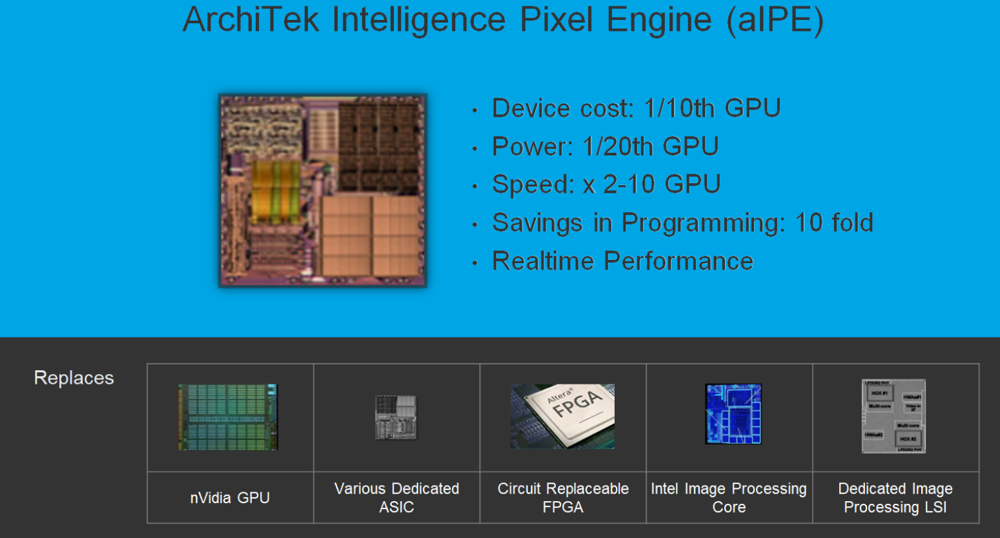
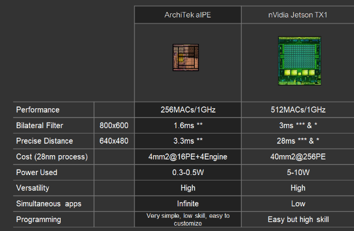
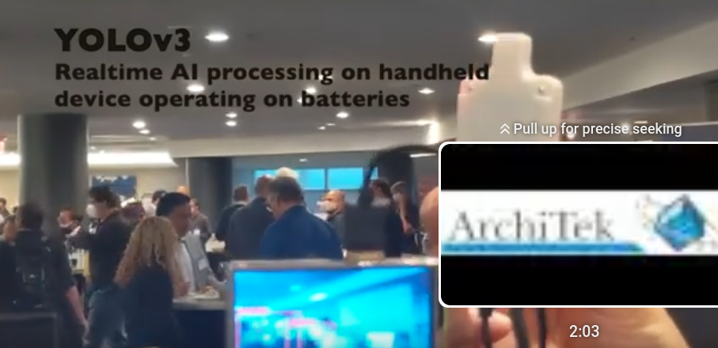
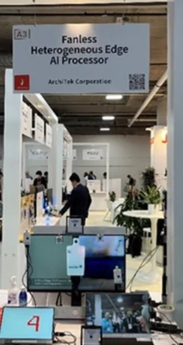
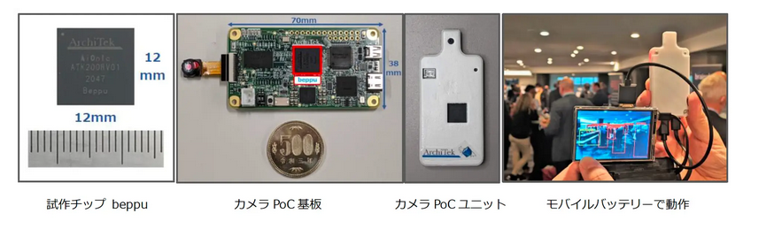

# ArchiTek Intelligence™ Pixel Engine (aIPE)
 

## tech
* https://architek.ai/en/business-home-en/
* https://architek.ai/ja/business-home-jp/
* https://www.youtube.com/@architekcorporation2803

aIPE is a programmable, image processing, dedicated LSI engine that combines custom hardware architecture—optimized for low power consumption and low latency—with innovative software flexibility using virtual engine technology.

## boards
* https://www.hackster.io/news/sifive-architek-announce-high-efficiency-sub-1w-edge-ai-processor-the-aionic-1d8aa537f77f

* https://contact.architek.co.jp/aionic-chichibu-edge-ai-processor-0?hs_preview=fkxiDSWC-172343744655

## demos

