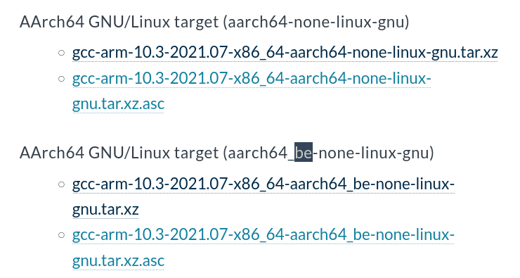

#  Build TensorFlow Lite for ARM boards


* https://www.tensorflow.org/lite/guide/build_arm
    * cmake way => https://www.tensorflow.org/lite/guide/build_cmake_arm


## build for AArch64 (ARM64) (RPI)


```

get the compiler :

LSB   https://developer.arm.com/-/media/Files/downloads/gnu-a/10.3-2021.07/binrel/gcc-arm-10.3-2021.07-x86_64-aarch64-none-linux-gnu.tar.xz
MSB   https://developer.arm.com/-/media/Files/downloads/gnu-a/10.3-2021.07/binrel/gcc-arm-10.3-2021.07-x86_64-aarch64_be-none-linux-gnu.tar.xz

```



```
export GIT_SSL_NO_VERIFY=1 

MSB
  ARMCC_PREFIX=/home/user/tflite_build_aarch64_gcc10/gcc_aarch64/gcc-arm-10.3-2021.07-x86_64-aarch64_be-none-linux-gnu/bin/aarch64_be-none-linux-gnu-
LSB
  ARMCC_PREFIX=/home/user/tflite_build_aarch64_gcc10/gcc_aarch64/gcc-arm-10.3-2021.07-x86_64-aarch64-none-linux-gnu/bin/aarch64-none-linux-gnu-

ARMCC_FLAGS="-funsafe-math-optimizations"
cmake -DCMAKE_C_COMPILER=${ARMCC_PREFIX}gcc \
  -DCMAKE_CXX_COMPILER=${ARMCC_PREFIX}g++ \
  -DCMAKE_C_FLAGS="${ARMCC_FLAGS}" \
  -DCMAKE_CXX_FLAGS="${ARMCC_FLAGS}" \
  -DCMAKE_VERBOSE_MAKEFILE:BOOL=ON \
  -DCMAKE_SYSTEM_NAME=Linux \
  -DCMAKE_SYSTEM_PROCESSOR=aarch64 \
  ../tensorflow_src/tensorflow/lite/
  
cmake --build .

cmake --build . -t label_image

```