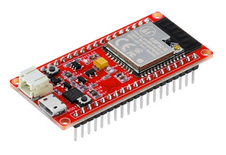

# esp32-wroom-32

ESP32 WIFI/BLE Board v1.0
* https://www.elecrow.com/wiki/esp32-wifible-board-v10.html

* Integrated LiPo Battery Charger.
* The sleep current of the ESP32 chip is less than 5 µA, making it suitable for battery 
* supports data rates of up to 150 Mbps, and 22 dBm output power at the PA 
