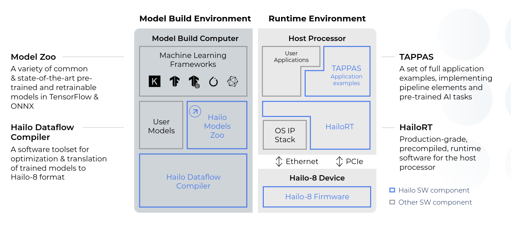

# hailo

* https://hailo.ai/

## learn curve

* dev env with suite
* tappas with real time demo
* use pre trained demo from zoo
* for pre trained use own dataset for retraining 
* for custom Model use the Dataflow Compiler for optimization and conversion 
* build realtime applications using HailoRT.

* sdk examples /local/workspace/hailort_examples
* appsCodeExample https://github.com/hailo-ai/Hailo-Application-Code-Examples

## topics

### hw
* [m2](./m2modules/readme.md)
* [rpi](./rpiHat/readme.md)

### host

* [dev-env](./devEnv/readme.md)

* [startkit](./startKit/readme.md)
    * [suite](./startKit/suite.md)
        * [HailoRT](./startKit/HailoRT.md)
        * [Dataflow Compiler]
        * [TAPPAS](./tappas/readme.md)

* [zoo](./zoo/readme.md)
