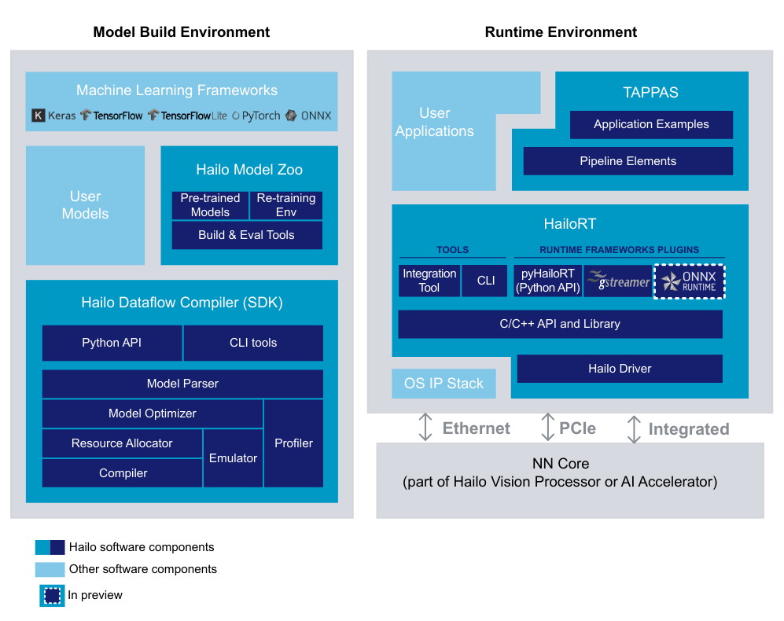

## Software Suite


recommended to use the Hailo Software Suite, that includes all of Hailo's SW components and insures compatibility across products versions

The Hailo Software Suite is composed of the Dataflow Compiler, HailoRT, TAPPAS and the Model Zoo




## get

* https://hailo.ai/developer-zone/software-downloads/

* install https://hailo.ai/developer-zone/documentation/hailo-sw-suite-2024-04/?sp_referrer=suite%2Fsuite_install.html#self-extracted-installation

```
hailo_sw_suite_2023-07.1_docker.zip
    ├── hailo_sw_suite_2023-07.1.tar  
    ├── hailo_sw_suite_docker_run.sh
```

## run

```
unzip hailo_ai_sw_suite_<version>.zip
./hailo_ai_sw_suite_docker_run.sh
```

```
./hailo_ai_sw_suite_docker_run.sh --help
========================================

Running Hailo Software Suite Docker image:
The default mode will create a new container. If one already exists, use --resume / --override

  -h, --help                                 Show help
  --resume                                   Resume the old container
  --override                                 Delete the existing container and start a new one
  --hailort-enable-service                   Run HailoRT service

  Options for HailoRT service:
  --service-enable-monitor
  --service-hailort-logger-path </path>      Note: the path is set inside docker container

```

* more container commands
```
./hailo_ai_sw_suite_docker_run.sh --resume  //  go back to the existing container


./hailo_ai_sw_suite_docker_run.sh --override    //  delete the existing container and create new one

```

## share data

```
in docker:
    /local/shared_with_docker/

host:
    /shared_with_docker  ## on the script run path

```

## in docker 

* version installed in docker
```
pip list | grep hailo

hailo-dataflow-compiler      3.24.0
hailo-log-collector          1.0.3
hailo-model-zoo              2.8.0       /local/workspace/hailo_model_zoo
hailo-tappas-dot-visualizer  3.25.0      /local/workspace/tappas/tools/trace_analyzer/dot_visualizer
hailo-tappas-run-apps        3.25.0      /local/workspace/tappas/tools/run_app
hailort                      4.14.0

```

* list available CLI
```
hailo -h 

[info] First time Hailo Dataflow Compiler is being used. Checking system requirements... (this might take a few seconds)
[Warning] It is recommended to have 32 GB of RAM, while this system has only 25 GB.
[Info] No GPU connected.
Component   Requirement      Found
==========  ==========       ==========  ==========
OS          Ubuntu           Ubuntu      Required
Release     20.04            20.04       Required
Package     python3-tk       V           Required
Package     graphviz         V           Required
Package     libgraphviz-dev  V           Required
Package     python3.8-dev    V           Required
RAM(GB)     16               25          Required
RAM(GB)     32               25          Recommended
CPU-Arch    x86_64           x86_64      Required
CPU-flag    avx              V           Required
Var:CC      unset            unset       Required
Var:CXX     unset            unset       Required
Var:LD      unset            unset       Required
Var:AS      unset            unset       Required
Var:AR      unset            unset       Required
Var:LN      unset            unset       Required
Var:DUMP    unset            unset       Required
Var:CPY     unset            unset       Required
usage: hailo [-h] [--version]
             {fw-update,ssb-update,fw-config,udp-rate-limiter,fw-control,fw-logger,scan,sensor-config,run,benchmark,monitor,parse-hef,measure-power,tutorial,analyze-noise,compiler,params-csv,parser,profiler,optimize,tb,visualizer,har,join,har-onnx-rt,help}
             ...

Hailo Command Line Utility

positional arguments:
  {fw-update,ssb-update,fw-config,udp-rate-limiter,fw-control,fw-logger,scan,sensor-config,run,benchmark,monitor,parse-hef,measure-power,tutorial,analyze-noise,compiler,params-csv,parser,profiler,optimize,tb,visualizer,har,join,har-onnx-rt,help}
                        Hailo utilities aimed to help with everything you need
    fw-update           Firmware update tool
    ssb-update          Second stage boot update tool
    fw-config           Firmware configuration tool
    udp-rate-limiter    Limit UDP rate
    fw-control          Useful firmware control operations
    fw-logger           Download fw logs to a file
    scan                Scans for devices (Ethernet or PCIE)
    sensor-config       Sensor configuration tool
    run                 Run a compiled network
    benchmark           Measure basic performance on compiled network
    monitor             Monitor of networks - Presents information about the running networks. To enable monitor, set in the application process the environment variable 'HAILO_MONITOR' to 1.
    parse-hef           Parse HEF to get information about its components
    measure-power       Measures power consumption
    tutorial            Runs the tutorials in jupyter notebook
    analyze-noise       Analyze network quantization noise
    compiler            Compile network to HEF binary files
    params-csv          Convert translated params to csv
    parser              Translate network to Hailo network
    profiler            Hailo models Profiler
    optimize            Optimize model
    tb                  Convert *.har or *.ckpt to Tensorboard
    visualizer          HAR visualization tool
    har                 Query and extract information from Hailo Archive file
    join                Join two models to a single model
    har-onnx-rt         Generates ONNX-Runtime model including pre/post processing
    help                show the list of commands

optional arguments:
  -h, --help            show this help message and exit
  --version             show program's version number and exit

```

* check hw
( install hailort-pcie-driver_4.17.0_all.deb )
```
 lspci | grep Co-processor
```

* cmds

```
Welcome to Hailo Software Suite Container
To list available commands, please type:

----------------------------------------------------

HailoRT:                hailortcli -h
Dataflow Compiler:      hailo -h
Hailo Model Zoo:        hailomz -h
TAPPAS:                 hailo_run_app -h

```