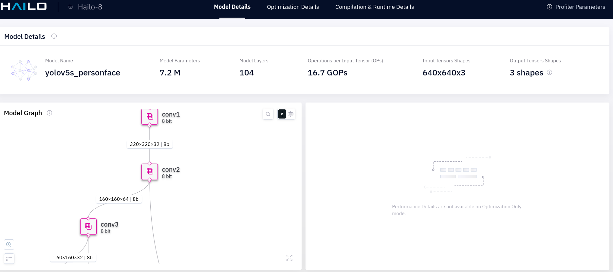

## info

* hailomz info yolov5s_personface

```
<Hailo Model Zoo INFO> Start run for network yolov5s_personface ...
<Hailo Model Zoo INFO> 
        task:                    pipeline
        input_shape:             640x640x3
        output_shape:            2x5x80
        operations:              16.71G
        parameters:              7.25M
        framework:               pytorch
        training_data:           Hailo internal
        validation_data:         Hailo internal
        eval_metric:             mAP
        full_precision_result:   47.7
        source:                  https://github.com/ultralytics/yolov5/releases/tag/v2.0
        license_url:             https://github.com/ultralytics/yolov5/blob/master/LICENSE

```

## parse

```
hailomz parse yolov5s_personface

<Hailo Model Zoo INFO> Start run for network yolov5s_personface ...
<Hailo Model Zoo INFO> Initializing the runner...
yolov5s_personface.zip: 100%|███████████████████████████████████████████████████████████████████████████████████████████████████████████████████████████| 23.1M/23.1M [00:01<00:00, 13.7MB/s]
[info] Translation started on ONNX model yolov5s_personface
[info] Restored ONNX model yolov5s_personface (completion time: 00:00:00.08)
[info] Extracted ONNXRuntime meta-data for Hailo model (completion time: 00:00:00.45)
[info] NMS structure of yolov5 (or equivalent architecture) was detected. Default values of NMS anchors were loaded to NMS config json
[info] Start nodes mapped from original model: 'images': 'yolov5s_personface/input_layer1'.
[info] End nodes mapped from original model: 'Conv_234', 'Conv_218', 'Conv_202'.
[info] Translation completed on ONNX model yolov5s_personface (completion time: 00:00:00.97)
[info] Saved HAR to: /local/shared_with_docker/faceDetect1/yolov5s_personface.har


```

```
├── [ 180]  hailo_examples.log
├── [   0]  hailort.log
├── [1.0K]  hailo_sdk.client.log
└── [ 28M]  yolov5s_personface.har


 > unpack har

├── harTAR
│   ├── yolov5s_personface.hn
│   ├── yolov5s_personface.metadata.json
│   ├── yolov5s_personface.nms.json
│   ├── yolov5s_personface.npz
│   ├── yolov5s_personface.original_model_meta.json
│   └── yolov5s_personface.postprocess.onnx

```


## profile 

```
hailomz profile yolov5s_personface
<Hailo Model Zoo DEPRECATION_WARNING> 'profile' command is deprecated and will be removed in future release. Please use 'hailo profiler' tool instead.
<Hailo Model Zoo INFO> Start run for network yolov5s_personface ...
<Hailo Model Zoo INFO> Initializing the hailo8 runner...
[info] Translation started on ONNX model yolov5s_personface
[info] Restored ONNX model yolov5s_personface (completion time: 00:00:00.07)
[info] Extracted ONNXRuntime meta-data for Hailo model (completion time: 00:00:00.41)
[info] NMS structure of yolov5 (or equivalent architecture) was detected. Default values of NMS anchors were loaded to NMS config json
[info] Start nodes mapped from original model: 'images': 'yolov5s_personface/input_layer1'.
[info] End nodes mapped from original model: 'Conv_234', 'Conv_218', 'Conv_202'.
[info] Translation completed on ONNX model yolov5s_personface (completion time: 00:00:00.93)
[info] Saved HAR to: /local/shared_with_docker/faceDetect1/yolov5s_personface.har
[info] Running profile for yolov5s_personface in state hailo_model
<Hailo Model Zoo INFO> Profiler report generated in yolov5s_personface.html
```

* generated html will include:



## get data

https://github.com/hailo-ai/hailo_model_zoo/blob/master/docs/DATA.rst

use the WIDERFACE

```

/local/shared_with_docker/.hailomz$ tree models_files/widerface/
models_files/widerface/
├── 2020-03-23
│   └── widerfaceval.tfrecord
└── 2022-06-14
    └── widerfacecalibration_set.tfrecord

```


???
(hailo_virtualenv) hailo@user-Latitude-5440:/local/shared_with_docker/ssd_mobilenet_v1_test$ grep validation_data: /local/workspace/hailo_model_zoo/hailo_model_zoo/cfg/networks/* | grep face
/local/workspace/hailo_model_zoo/hailo_model_zoo/cfg/networks/arcface_mobilefacenet_nv12.yaml:  validation_data: lfw
/local/workspace/hailo_model_zoo/hailo_model_zoo/cfg/networks/arcface_mobilefacenet.yaml:  validation_data: lfw
/local/workspace/hailo_model_zoo/hailo_model_zoo/cfg/networks/arcface_r50.yaml:  validation_data: lfw
/local/workspace/hailo_model_zoo/hailo_model_zoo/cfg/networks/face_attr_resnet_v1_18.yaml:  validation_data: celeba test
/local/workspace/hailo_model_zoo/hailo_model_zoo/cfg/networks/retinaface_mobilenet_v1.yaml:  validation_data: wider val
/local/workspace/hailo_model_zoo/hailo_model_zoo/cfg/networks/yolov5s_personface_nv12_fhd.yaml:  validation_data: Hailo internal
/local/workspace/hailo_model_zoo/hailo_model_zoo/cfg/networks/yolov5s_personface.yaml:  validation_data: Hailo internal

????

## eval

hailomz eval yolov5s_personface  --data-path /local/shared_with_docker/.hailomz/widerface --calib-path /local/shared_with_docker/.hailomz/widerface/WIDER_train/images/


## optimize

```

 hailomz optimize yolov5s_personface --calib-path /local/shared_with_docker/.hailomz/widerface/WIDER_train/images --hw-arch hailo8 --performance


3998/4000 [============================>.] - ETA: 2s - total_distill_loss: 0.1672 - _distill_loss_yolov5s_personface/conv70: 0.0488 - _distill_loss_yolov5s_personface/conv63: 0.0601 - _dist3999/4000 [============================>.] - ETA: 1s - total_distill_loss: 0.1672 - _distill_loss_yolov5s_personface/conv70: 0.0488 - _distill_loss_yolov5s_personface/conv63: 0.0601 - _dist4000/4000 [==============================] - ETA: 0s - total_distill_loss: 0.1672 - _distill_loss_yolov5s_personface/conv70: 0.0488 - _distill_loss_yolov5s_personface/conv63: 0.0601 - _dist4000/4000 [==============================] - 4037s 1s/step - total_distill_loss: 0.1672 - _distill_loss_yolov5s_personface/conv70: 0.0488 - _distill_loss_yolov5s_personface/conv63: 0.0601 - _distill_loss_yolov5s_personface/conv55: 0.0584
[info] Quantization-Aware Fine-Tuning is done (completion time is 04:29:33.87)
[info] Layer Noise Analysis skipped
[info] Model Optimization is done

[info] Saved HAR to: /local/shared_with_docker/faceDetect1/yolov5s_personface.har

```

hailomz eval yolov5s_personface --visualize --data-path


# hef

get 

```
wget https://hailo-model-zoo.s3.eu-west-2.amazonaws.com/HailoNets/MCPReID/personface_detector
/yolov5s_personface/2022-04-01/yolov5s_personface.hef

```

benchmark

```
> hailortcli benchmark yolov5s_personface.hef 
Starting Measurements...
Measuring FPS in HW-only mode
Network yolov5s_personface/yolov5s_personface: 100% | 4901 | FPS: 326.56 | ETA: 00:00:00
Measuring FPS (and Power on supported platforms) in streaming mode
[HailoRT] [warning] Using the overcurrent protection dvm for power measurement will disable the overcurrent protection.
If only taking one measurement, the protection will resume automatically.
If doing continuous measurement, to enable overcurrent protection again you have to stop the power measurement on this dvm.
Network yolov5s_personface/yolov5s_personface: 100% | 4873 | FPS: 324.71 | ETA: 00:00:00
Measuring HW Latency
Network yolov5s_personface/yolov5s_personface: 100% | 1192 | HW Latency: 7.50 ms | ETA: 00:00:00

=======
Summary
=======
FPS     (hw_only)                 = 326.567
        (streaming)               = 324.718
Latency (hw)                      = 7.49588 ms
Device 0000:01:00.0:
  Power in streaming mode (average) = 3.43733 W
                          (max)     = 3.48117 W

```

```


hailortcli parse-hef ./yolov5s_personface.hef

hailortcli parse-hef ./yolov5s_personface.hef 
Architecture HEF was compiled for: HAILO8
Network group name: yolov5s_personface, Single Context
    Network name: yolov5s_personface/yolov5s_personface
        VStream infos:
            Input  yolov5s_personface/input_layer1 UINT8, NHWC(640x640x3)
            Output yolov5s_personface/conv70 UINT8, FCR(20x20x21)
            Output yolov5s_personface/conv63 UINT8, FCR(40x40x21)
            Output yolov5s_personface/conv55 UINT8, FCR(80x80x21)


```


# retrain

* https://github.com/hailo-ai/hailo_model_zoo/blob/master/hailo_models/personface_detection/docs/TRAINING_GUIDE.rst

