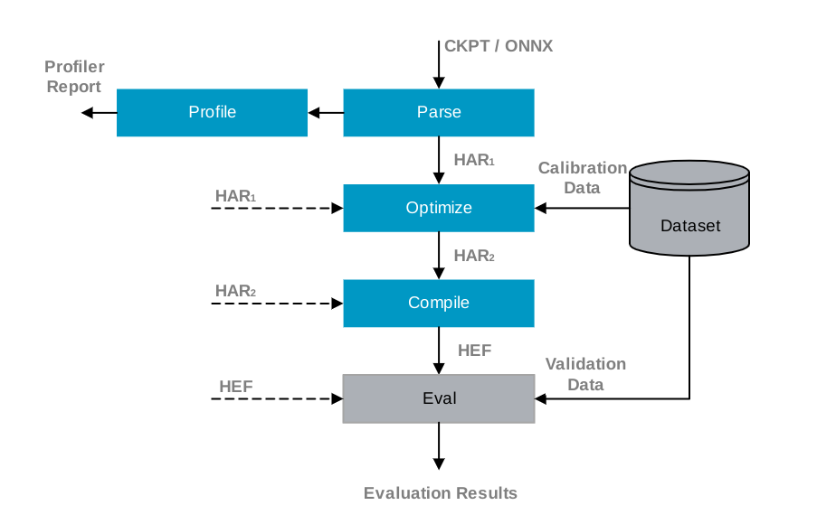

# zoo

* https://github.com/hailo-ai/hailo_model_zoo

* https://hailo.ai/products/hailo-software/model-explorer/

 Full functionality includes:

* Parse: model translation of the input model into Hailo's internal representation.
* Profiler: generate profiler report of the model. The report contains information about your model and expected performance on the Hailo hardware.
* Optimize: optimize the deep learning model for inference and generate a numeric translation of the input model into a compressed integer representation.
* Compile: run the Hailo compiler to generate the Hailo Executable Format file (HEF) which can be executed on the Hailo hardware.
* Evaluate: infer the model using the Hailo Emulator or the Hailo hardware and produce the model accuracy.

high-level view of the model-zoo evaluation process

