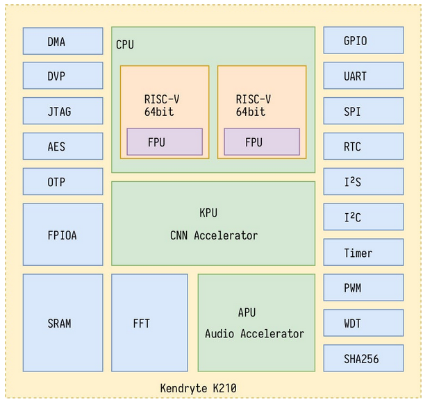

# k210

* https://maixduino.sipeed.com/en/hardware/k210.html

https://www.seeedstudio.com/blog/2019/09/12/get-started-with-k210-hardware-and-programming-environment/

## kpu?

KPU (Kendryte Processing Unit) is a neural network processing unit within the K210, optimized for CNN (Convolutional Neural Network) inference. It allows for low-power and fast processing of image recognition tasks on the device itself, ideal for edge AI applications without needing cloud resources.

use is constrained to relatively simple AI models and specific tasks like CNN-based image processing.