# video intros

* take the best from both words

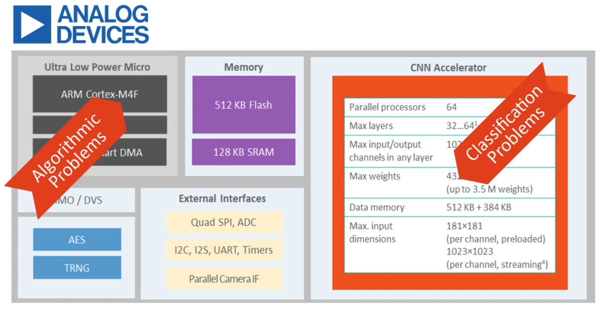

# model

* one layer

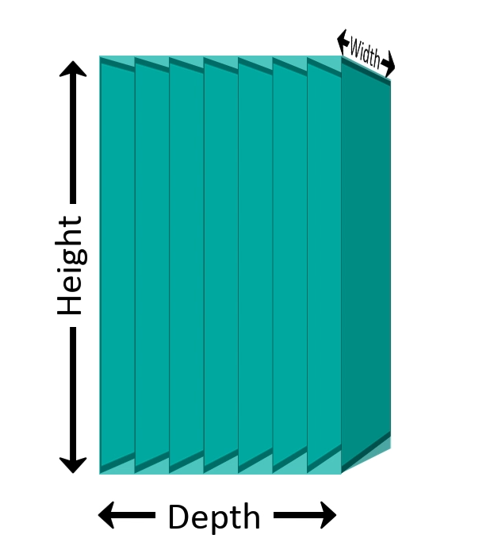

* convulsion operation

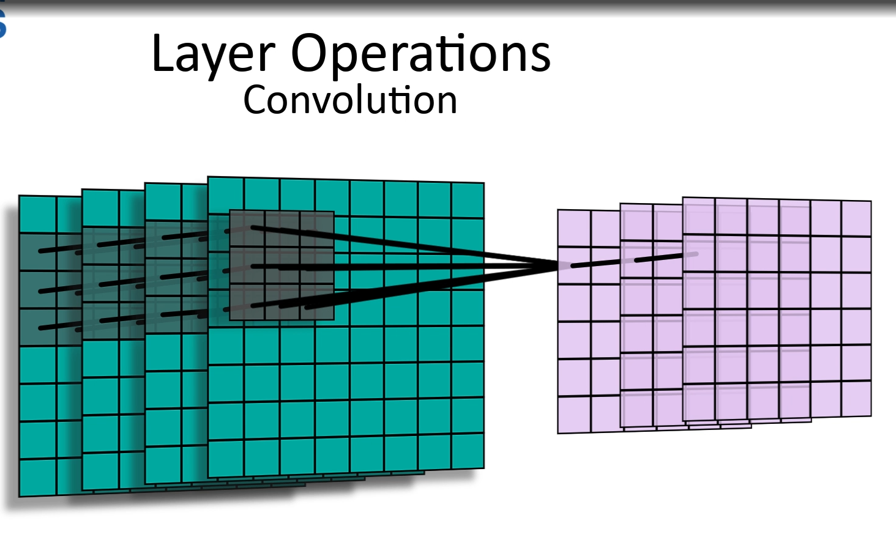

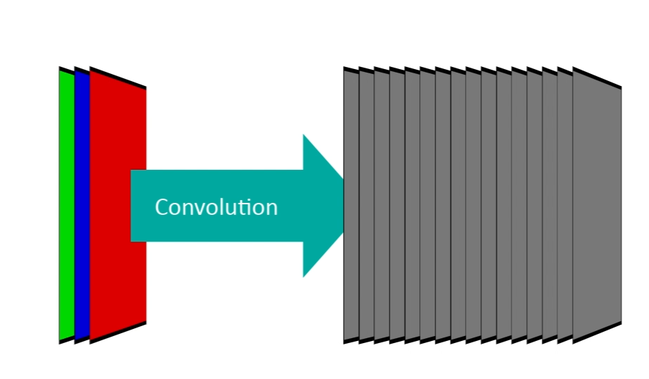

* pooling operation

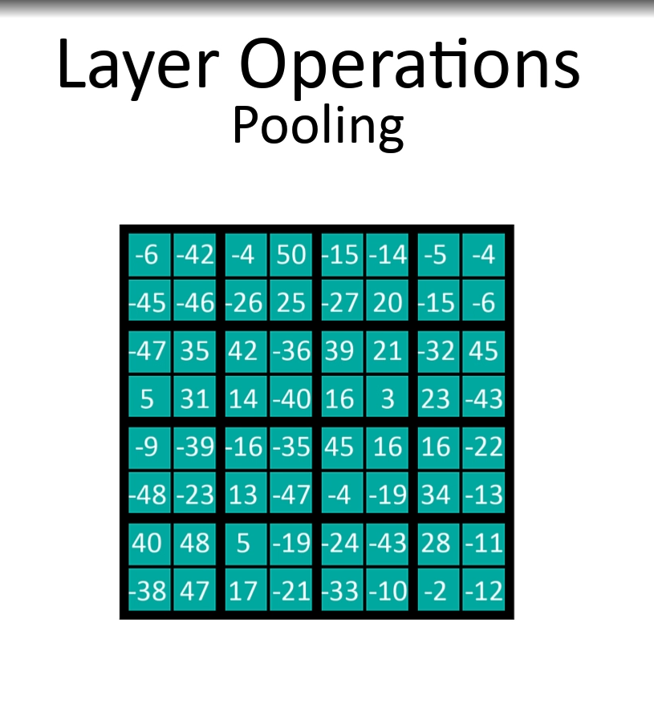

* we have more many operations ;
* in code:

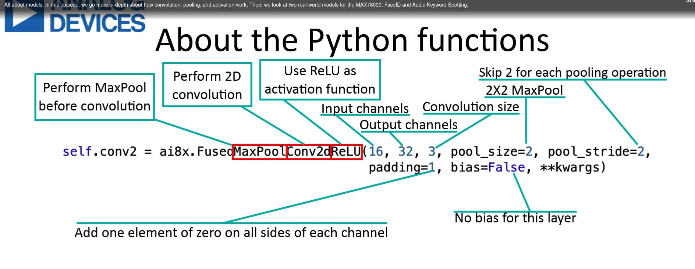

* apps

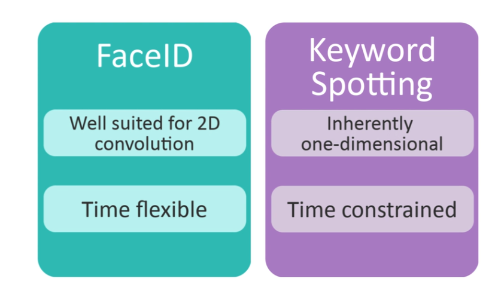

## face

* get embeeding from face and compare to precalc one;

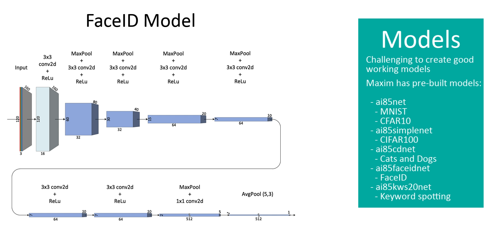

## voice

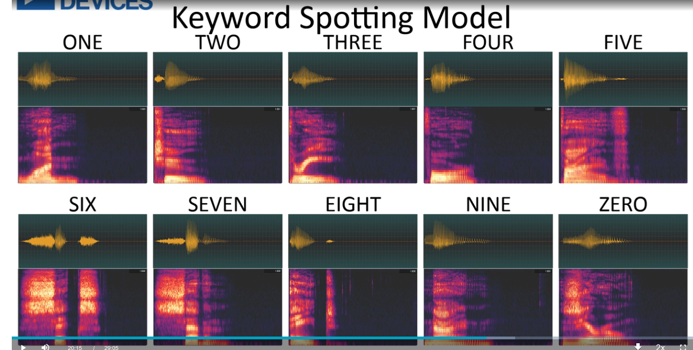

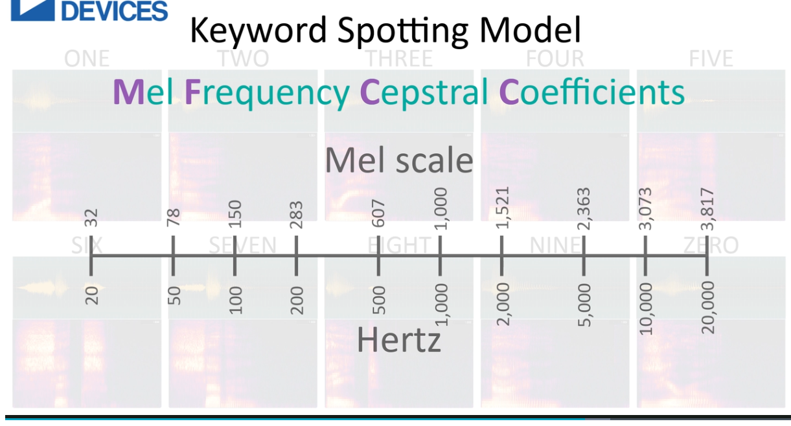

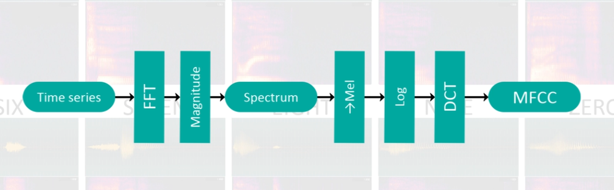

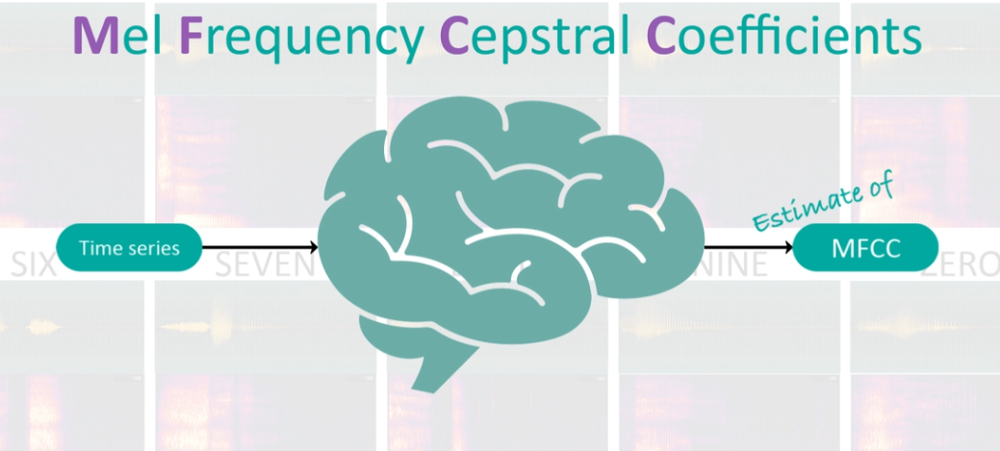

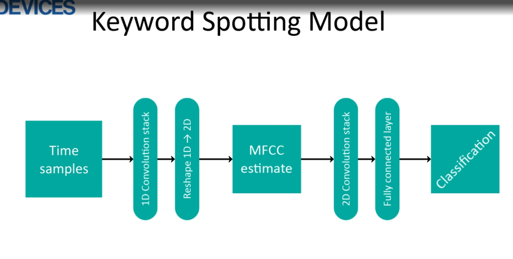

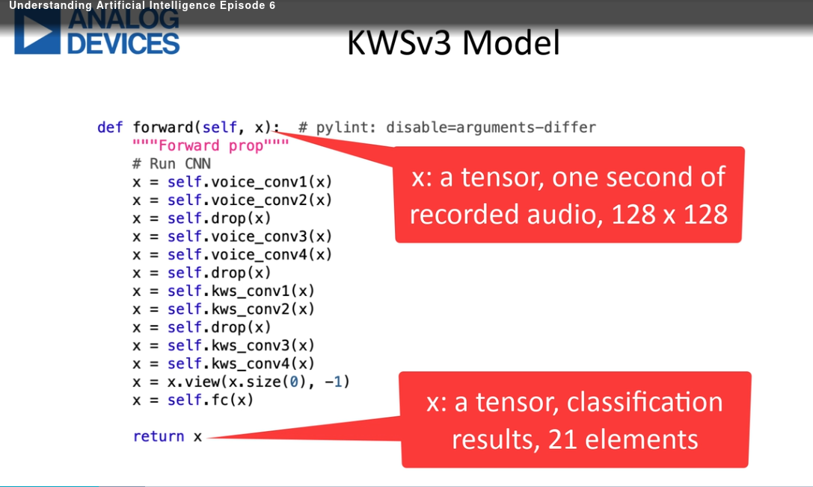

## HW

* cnn:

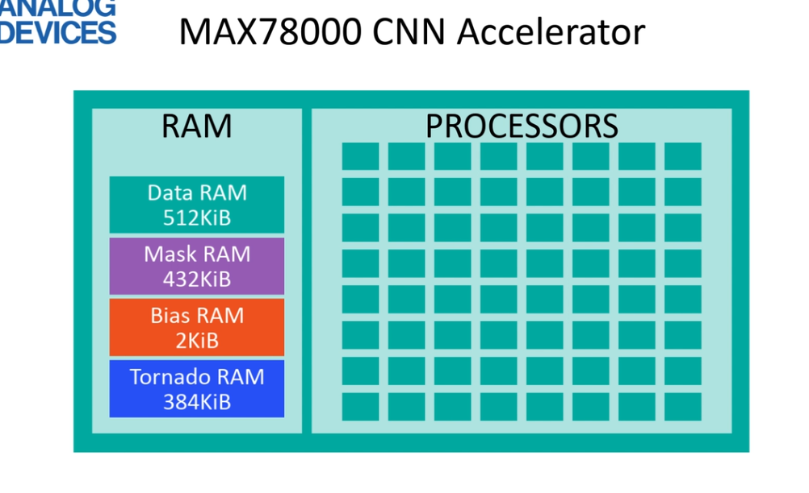

* each process element:

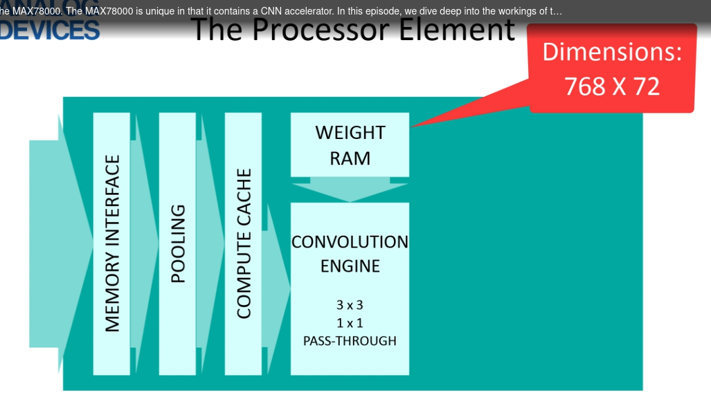

* why 762*72:

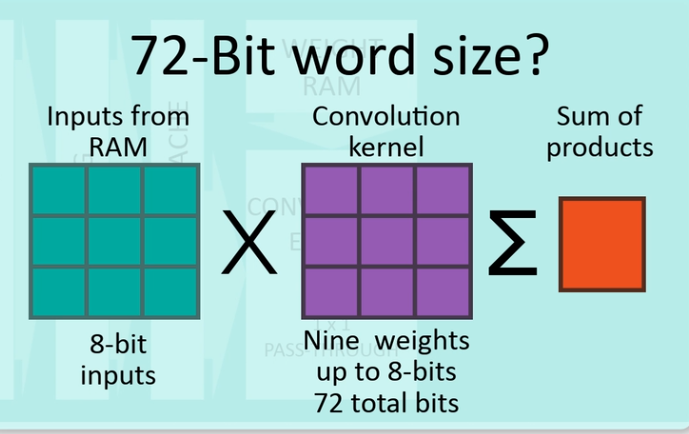

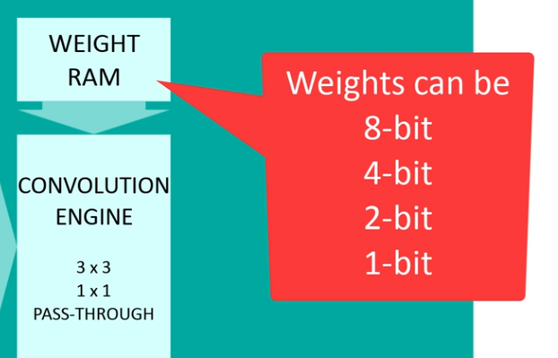

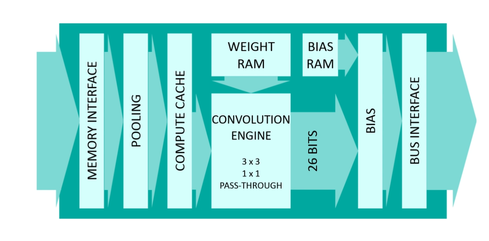

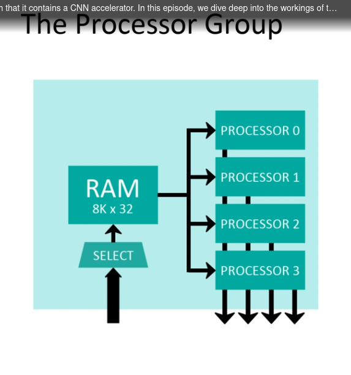

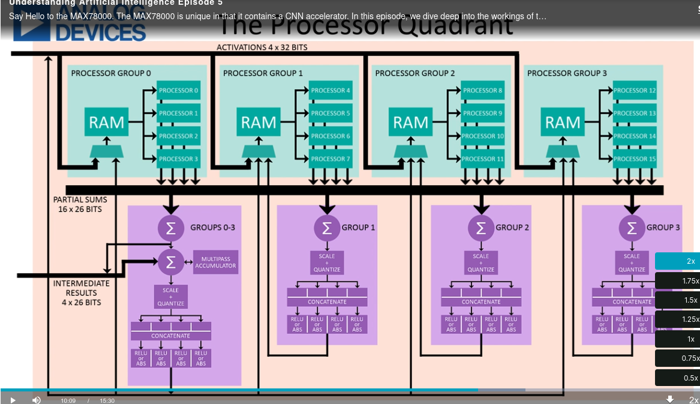