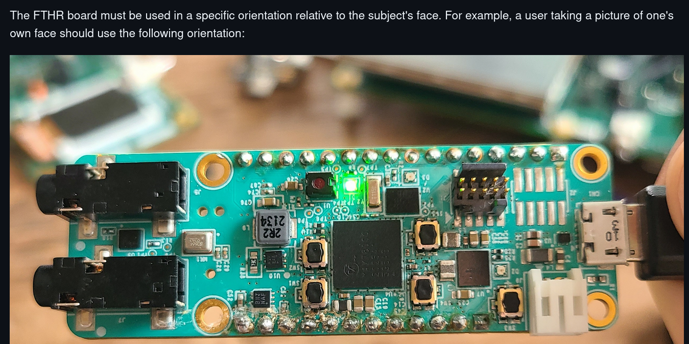

# face id

## specs
* [technical-articles](https://www.analog.com/en/resources/technical-articles/face-identification-using-max78000.html)
* [FacialRecognitionSystem](https://github.com/analogdevicesinc/ai8x-training/blob/develop/docs/FacialRecognitionSystem.md)


### videos
* [media center1](https://www.analog.com/en/resources/media-center/videos/6319992623112.html)


## updated demo
* [msdk demo fthr](https://github.com/analogdevicesinc/msdk/tree/main/Examples/MAX78000/CNN/facial_recognition)
    * This project is supported on the MAX78000FTHR board only

## tree src

```
maxCNN/sdk/Examples/MAX78000/CNN/facial_recognition
├── build
├── db_gen
├── facial_recognition.launch
├── gen_db.sh
├── include
├── main.c
├── Makefile
├── project.mk
├── README.md
├── Resources
├── run.sh
├── SDHC_weights
└── src

```


## deploy

* FaceID model is loaded from an SD card due to memory constraints
* weights_2.bin in the root directory of a FAT32-formatted micro-SDHC card

364K    sdk/Examples/MAX78000/CNN/facial_recognition/SDHC_weights/weights_2.bin


```
source <maxCNN>/env
source <maxCNN>/sdk/Tools/SDK_install_root/setenv.sh
source <maxCNN>/ai8x-training/venv/bin/activate

cd $MAXIM_PATH/Examples/MAX78000/CNN/facial_recognition
```

```
> make

will build:
3.2M facial_recognition/build/max78000.elf


> ./run.sh

will deploy to target
```


## run



Status LEDs:

    RED: No face detected
    GREEN: Face detected
    YELLOW: Face detected, recapturing image


## add faces

* use ai8x-training environment
* [taking-face-pictures notes](https://github.com/analogdevicesinc/msdk/tree/main/Examples/MAX78000/CNN/facial_recognition#taking-face-pictures)

```
// images are in 
├── db
    ├── Name1
    │    ├── Image1.jpg
         ....
```

```
source???
sh gen_db.sh
make clean
make


```


        