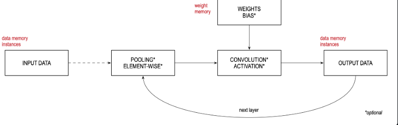

#  cnn

* Convolutional Neural Network (CNN) accelerator

The MAX78000/MAX78002 accelerators contain 64 parallel processors. There are four quadrants that contain 16 processors each.

Each processor includes a pooling unit and a convolutional engine with dedicated weight memory:

