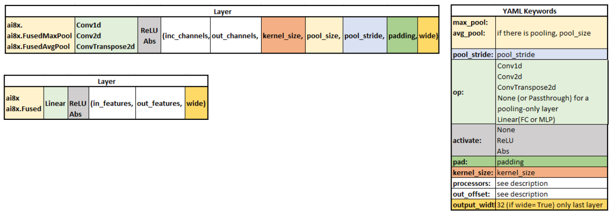

# YAML network description

* see ```maxCNN/MaximAI_Documentation/Guides/YAML Quickstart.md```

 the outcome of training a model is a checkpoint (PyTorch). Checkpoint files only include the weights, but not the network operators and layer sequence, and there is no scheduling of hardware resources. However, all of these are needed for the synthesis tool in order to program the MAX78000/MAX78002. The purpose of the YAML file is to describe the model in a hardware-centric fashion.


### (1) Global Configuration Section


*./train.py --epochs 200 --deterministic --compress schedule.yaml --model **ai85net5** --dataset **MNIST** --confusion --param-hist --pr-curves --embedding --device MAX78000*

```yaml
# ------------   Global Configuration   ------------
arch: ai85net5  # Mandatory: use the name of the model as in training
dataset: MNIST  # Mandatory: use the name of the dataset as in training 
```


### (2) Layer Description Section**

The layer descriptions section defines each layer as it appears in the model. This section starts with the “`layers`“ keyword, followed by the configuration of each layer.  

Use “`-`” as the delimiter to start each layer. The order of keywords in the description of a layer is arbitrary.

```yaml
# ------------   Layers   ------------
- pad: 0
  activate: ReLU
  out_offset: 0x2000
  processors: 0xffffffffffffffff
  data_format: HWC
  operation: Conv1d
  kernel_size: 1
```


The following figure shows how a layer in the model is mapped to YAML:




The table below shows the description of frequently used keywords. For a complete list of keywords and more description, please check the main documentation [README.md](https://github.com/analogdevicesinc/MaximAI_Documentation/blob/master/README.md).

| keyword                 | Description                                                  | Available options                                            |
| ----------------------- | ------------------------------------------------------------ | ------------------------------------------------------------ |
| data_format             | **ONLY in first layer**, specifies the organization of data in memory. The optimum choice depends on the data source (interleaved channels/HWC or channels in sequence/CHW). When there is no particular preference, HWC is recommended for input data of less than 90×91 per channel. | CHW or HWC                                                   |
| op<br/>operation        | The layer operation as in the model. Use None or Passthrough for a pooling-only layer. | Conv1d, Conv2d, ConvTranspose2d, None (or Passthrough), Linear (or FC or MLP), Add, Sub, Xor, Or |
| pad (optional)          | The padding of the layer in the model                        | For Conv2d , this value can be 0 , 1 (the default), or 2 .<br/>For Conv1d , the value can be 0 , 1 , 2 , or 3 (the default).<br/>For Passthrough , this value must be 0 (the default). |
| activate (optional)     | The layer activation                                         | ReLU , Abs or None (the default).                            |
| max_pool (optional)     | The pool_size if the layer includes MaxPool                  | 1 to 16                                                      |
| avg_pool (optional)     | The pool_size if the layer includes AvgPool                  | 1 to 16                                                      |
| pool_stride (optional)  | The pool_stride if the layer includes MaxPool or AvgPool     | 1 to 16                                                      |
| kernel_size (optional)  | The kernel size                                              | For conv2d: 1 (1×1) or 3 (3×3) (default)<br/>For conv1d: 1 (default) to 9 |
| processors              | Each bit of this 64-bit processor map represents enabling of one of the 64 processors in CNN.  The number of enabled processors should match the input channel count. If there are more than 64 channels, the number of processor is the largest integer division of the channel count up to 64, rounded to the next multiple of 4. For example, 60 processors (0x0fffffffffffffff) are specified for 120 channels, or 52 processors for 100 channels.<br/> **Note 1:** If possible, try to use processors with non-overlapping memory instances (*4 processors share the same memory instance*) in consecutive layers (e.g. processors: 0x0000000000000001 in layer 1 and 0x00000000000ffff0 in layer 2) – this will make it easier to allocate large portions of memory.<br/>**Note 2:** if CHW data_format is used, processors must be attached to different memory instances (e.g. for <u>3 input channels: 0x0000000000000111 in CHW, 0x0000000000000007 in HWC).<br/>**Note 3:**  For optimum efficiency, it is recommended to choose the number of channels as a multiple of 4 in each layer.<br/>**Note 4:**  In linear layers, the number of processors is the number of channels before flattening. | 0x0000000000000001  to 0xffffffffffffffff                    |
| out_offset (optional)   | The relative offset inside the data memory to write the output data to.<br/>**Note 5:**  The input of each layer is taken from the output offset of the previous layer. To avoid overwriting an input that has not been consumed, use ping-ponging between out_offset=0 and half the memory (0x4000)  or less in consecutive layers. | 0x0000 to 0x8000                                             |
| in_offset (optional)    | Specifies the offset into the data memory instances where the input data should be loaded from. When not specified, this key defaults to the previous layer’s `out_offset`, or `0` for the first layer. | 0x0000 to 0x8000 (default: out_offset of last layer)         |
| flatten (optional)      | Used in Linear layers to specify that 2D input data should be transformed to 1D data | True, False (default)                                        |
| output_width (optional) | Specifies the output number of bits. It is used **only in the last layer** if there is no activation to specify 32-bit output of unclipped data in Q17.14 format. <br/>**Note 6:**  To use `output_width: 32`, the last layer in the model must be trained with *wide=True* | 8 (default),  32                                             |
| in_dim (optional)       | Specifies the dimensions of the input data. Automatically computed in most cases, **but must be specified when changing from 1D to 2D data or vice versa** | [x, y]                                                       |
| streaming (optional)    | Specifies if the layer is using streaming (FIFO enabled). This is necessary when the input data dimensions exceed the available data memory (data greater than 90×91). When enabling `streaming`, all prior layers have to enable `streaming` as well. `streaming`  is limited to 8 consecutive layers or fewer, and is limited to four FIFOs (up to 4 input channels in CHW and up to 16 channels in HWC format). See Example 3. <br/>**Note 7:** **The final streaming layer must use padding.** | True, False(default)                                         |
| name<br />(optional)    | Optionally specifies the name for a layer so it can be referred to by name instead of only by number. | string                                                       |
| in_sequences (optional) | Specifies the layer that the input of current layer comes from. It can be used to point to the output of one or more arbitrary previous layers, for example when processing the same data using two different kernel sizes, or when combining the outputs of several prior layers. `in_sequences` can be specified as an integer or string (for a single input) or as a list (for multiple inputs). As a special case, `-1` or `input` refer to the input data. The `in_offset` and `out_offset` must be set to match the specified sequence. See Example 5. | [i,j] (default: last layer)<br/> -1 or input for input data  |
| write_gap (optional)    | specifies the number of channels that should be skipped during write operations (this value is multiplied with the output multi-pass, i.e., write every *n*th word where *n = write_gap × output_multipass*). This creates an interleaved output that can be used as the input for subsequent layers that use an element-wise operation, or to concatenate multiple inputs to form data with more than 64 channels.<br/>Set `write_gap` to `1` to produce output for a subsequent two-input element-wise operation. See Example 5. | integer                                                      |
| eltwise (optional)      | element-wise operations can also be added “in-flight” to `Conv2d`. In this case, the element-wise operation is specified using the `eltwise` key. See Example 5.<br/>**Note 8: On MAX78000, this is only supported for 64 channels, or up to 128 channels when only two operands are used. Use a separate layer for the element-wise operation when more operands or channels are needed instead of combining the element-wise operator with a convolution.** | none                                                         |


