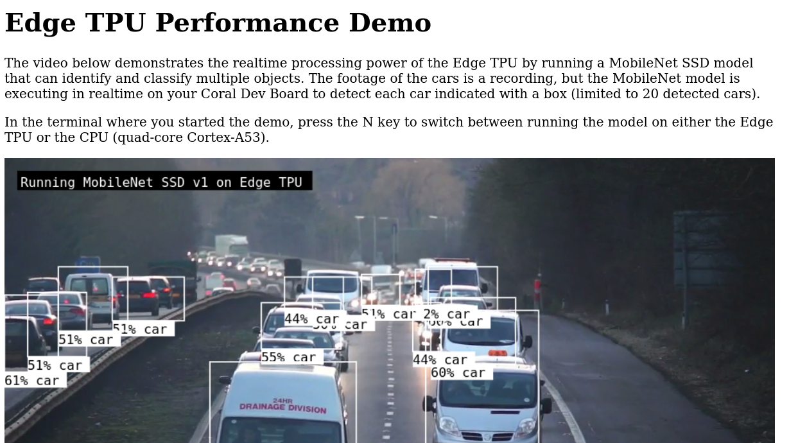

# demo app

edgetpu_demo --stream

```bash
#!/bin/bash

readonly TEST_DATA="/usr/share/edgetpudemo"
readonly VIDEO_DEVICE_FILE="${TEST_DATA}/video_device.mp4"
readonly VIDEO_STREAM_FILE="${TEST_DATA}/video_stream.mp4"
readonly TPU_MODEL_FILE="${TEST_DATA}/mobilenet_ssd_v1_coco_quant_postprocess_edgetpu.tflite@Running MobileNet SSD v1 on Edge TPU"
readonly CPU_MODEL_FILE="${TEST_DATA}/mobilenet_ssd_v1_coco_quant_postprocess.tflite@Running MobileNet SSD v1 on CPU"
readonly LABELS_FILE="${TEST_DATA}/coco_labels.txt"

if [[ "$1" == "--device" ]]; then
  echo "Press 'q' to quit."
  echo "Press 'n' to switch between models."

  edgetpu_detect \
      --source "${VIDEO_DEVICE_FILE}" \
      --model "${TPU_MODEL_FILE},${CPU_MODEL_FILE}" \
      --labels "${LABELS_FILE}" \
      --filter car,truck \
      --max_area 0.1 \
      --color white \
      --loop \
      --displaymode fullscreen
elif [[ "$1" == "--stream" ]]; then
  echo "Press 'q' to quit."
  echo "Press 'n' to switch between models."

  SERVER_INDEX_HTML="${TEST_DATA}/index.html" edgetpu_detect_server \
      --source "${VIDEO_STREAM_FILE}" \
      --model "${TPU_MODEL_FILE},${CPU_MODEL_FILE}" \
      --labels "${LABELS_FILE}" \
      --filter car,truck \
      --max_area 0.1 \
      --color white \
      --loop
else
  echo "Run on-device inference:"
  echo "  $0 --device"
  echo "Run streaming server:"
  echo "  $0 --stream"
fi
```

## run

```
INFO:edgetpuvision.streaming.server:Camera start recording
filesrc location=/usr/share/edgetpudemo/video_stream.mp4 ! qtdemux ! tee name=t
t. ! queue max-size-buffers=1 ! h264parse ! video/x-h264,stream-format=byte-stream,alignment=nal ! appsink name=h264sink emit-signals=True max-buffers=1 drop=False sync=False
t. ! queue max-size-buffers=1 ! decodebin ! glfilterbin filter=glbox ! video/x-raw,format=RGB,width=300,height=300 ! appsink name=appsink emit-signals=True max-buffers=1 drop=True sync=False
INFO:edgetpuvision.streaming.server:[192.168.100.66:57892] Tx thread finished
INFO:OpenGL.acceleratesupport:No OpenGL_accelerate module loaded: No module named 'OpenGL_accelerate'
INFO:edgetpuvision.streaming.server:[192.168.100.66:57892] Stopping...
INFO:edgetpuvision.streaming.server:[192.168.100.66:57892] Stopped.
INFO:edgetpuvision.streaming.server:Number of active clients: 1
```

