# classification

## example - figure classification

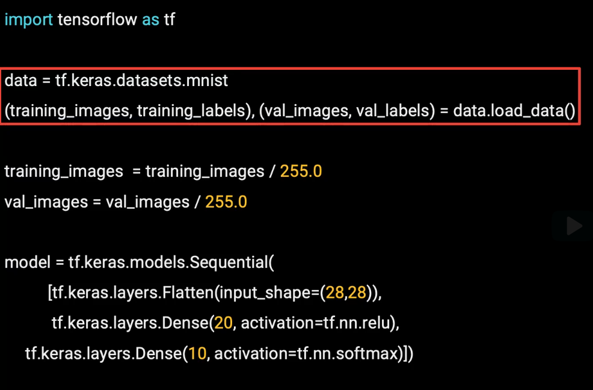

### data set

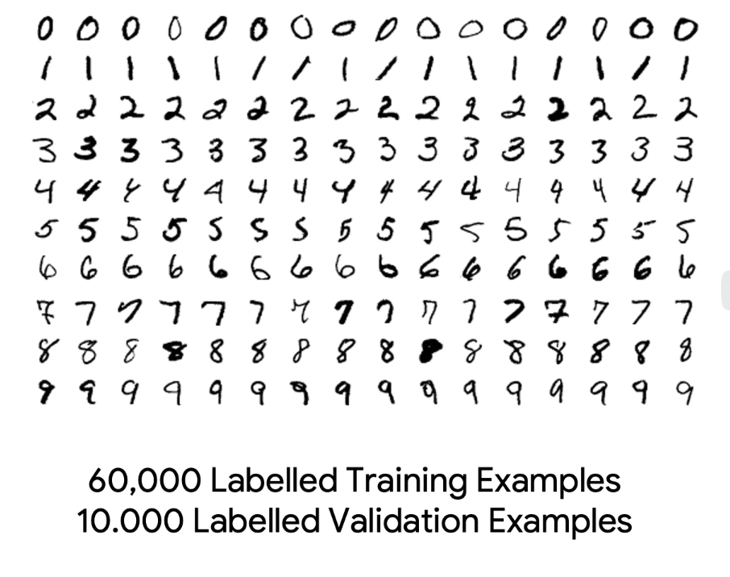

The handwriting digits are 28 by 28 monochrome, which means
each pixel value is from 0 to 255.
We want to normalize these to use them in a neural network.
And it behaves much better if the values are between 0 and 1.
So we can just divide the image values by 255.

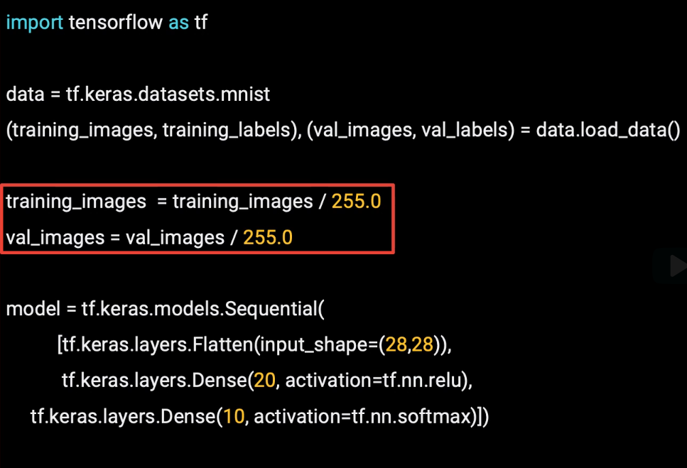

### network

* Sequential can be used to define a neural network by listing the layers of that neural network.

Our images are 28 by 28 in dimension.
So the first thing that we can do in our sequential is to define an operation to flatten these out,
so that we can feed them into the neural network.
we'll define a layer of neurons And we have 20 neurons in this layer (This number is purely arbitrary for now)

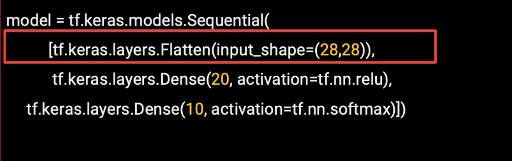

The next layer has 20 neurons, so we need our images
to be in the same dimension as that layer, considered
to be 20 by 1, so our images will also need to be something by 1,
in order to fit.
The easiest way to do this is to flatten the 28 by 28, which is 784 pixels,
into a 784 by 1.
And that's what a flattened layer does.

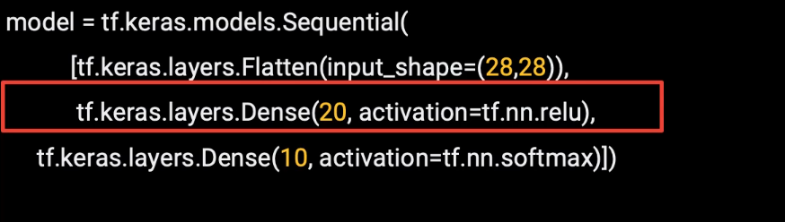

### activation function

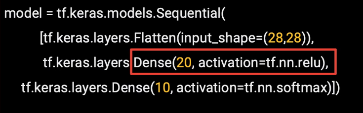

It's called ReLU, which stands for rectified linear unit.
every neuron will call its activation function when that layer is used.
The ReLU activation function changes any output that is less than 0 to 0.

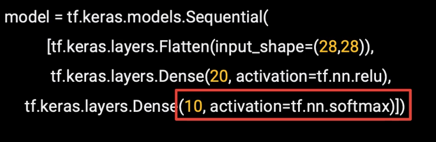
this will find the neuron from amongst the 10 that has the highest value.

### final layer

The final layer will have 10 neurons in it because we have 10 classes.
And these are the digits 0 through 9.

### network

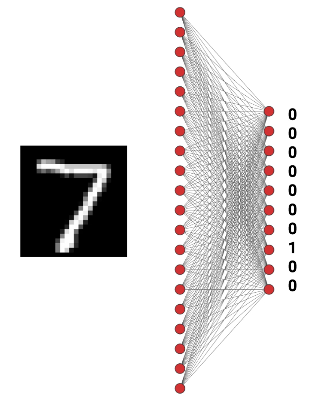

### compile

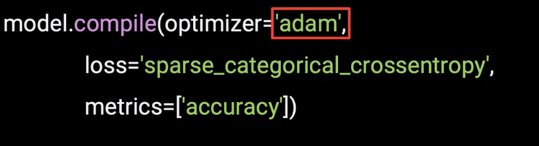

* optimizer - Adam can actually vary its learning rate helping us to converge more quickly.
* for classification, as we have a number of categories instead of a single value. And we need the loss across all the categories. This means that you'll generally use a categorical loss function.

### train
we can train for just 20 epochs.
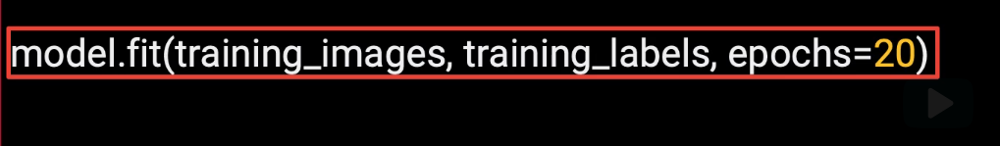

### predict

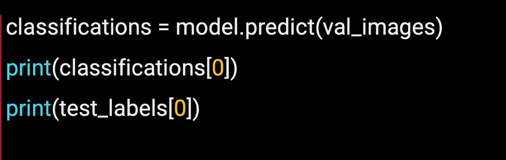

running out on the entire validation set of 10,000,
printing out the classification for the first one, and comparing it against the actual label.
