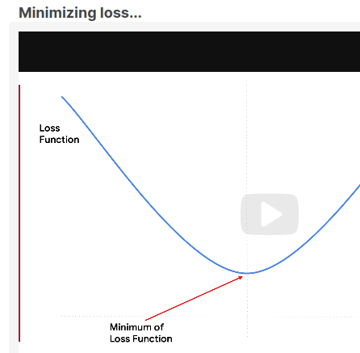
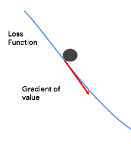

# Gradient descent

plot our loss function - squaring values to remove the negatives - so our function is a square of something.
Square functions have a parabolic shape 

If you differentiate the values with respect to the loss function,  you'll get a gradient.
use it to determine the direction towards the bottom.
It's actually the negative of the gradient points that way.
You have no idea how far it is to the bottom, but at least you know the correct direction.

You know what the direction is, and you can pick a step size.
The step size is often called the learning rate.

an advanced technique is to adjust the learning rate on the fly.

* [see lab2](lab2.md)
