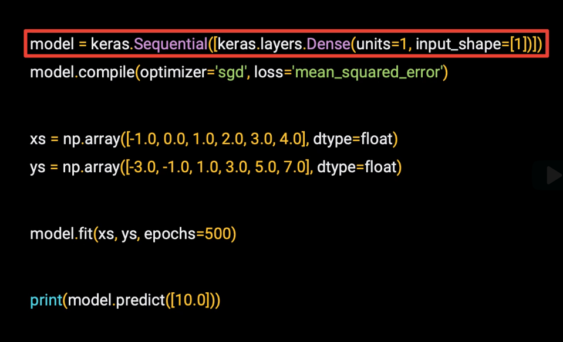
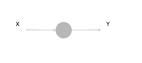
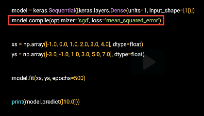
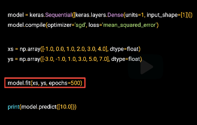

# neural networks




sequential network


* we only have one entry, so we only have one layer.
* This layer is a dense, so that we know it's a densely connected network.
* The units parameter tells us how many neurons will be in the layer.
* tell at the input shape.* 
* We're training a neural network on single x's to predict single y's.



## compile



* define the loss function and an optimizer.
* loss function is mean squared error, as we used previously.* 
* The optimizer is SGD, which stands for Stochastic Gradient Descent.


##  fitting



* We're fitting the x's to the y's.
* We'll do this for 500 epochs, where an epoch is each of the steps 
 * make a guess, 
 * measure the loss of the guess, 
 * optimize, and continue. 

## predict

*  use the model to predict the y for a given x.


### test (lab3)

```
import tensorflow as tf
import numpy as np
from tensorflow import keras


# define a neural network with one neuron
# for more information on TF functions see: https://www.tensorflow.org/api_docs
model = tf.keras.Sequential([keras.layers.Dense(units=1, input_shape=[1])])

# use stochastic gradient descent for optimization and
# the mean squared error loss function
model.compile(optimizer='sgd', loss='mean_squared_error')

# define some training data (xs as inputs and ys as outputs)
xs = np.array([-1.0,  0.0, 1.0, 2.0, 3.0, 4.0], dtype=float)
ys = np.array([-3.0, -1.0, 1.0, 3.0, 5.0, 7.0], dtype=float)

# fit the model to the data (aka train the model)
model.fit(xs, ys, epochs=500)

```

```
print(model.predict([10.0]))

[[18.98506]]

```

