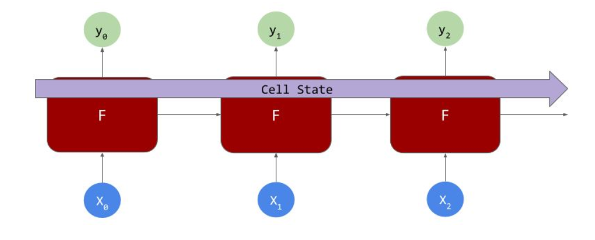

# Long Short Term Memory 

not only are values passed from neuron to neuron, so that X0 can impact Y1, X1 can impact Y2, but values from further back can also have an impact -- so that X0 could impact Y99 for example. This is achieved using a data structure called a Cell State where context can be preserved across multiple neurons.

