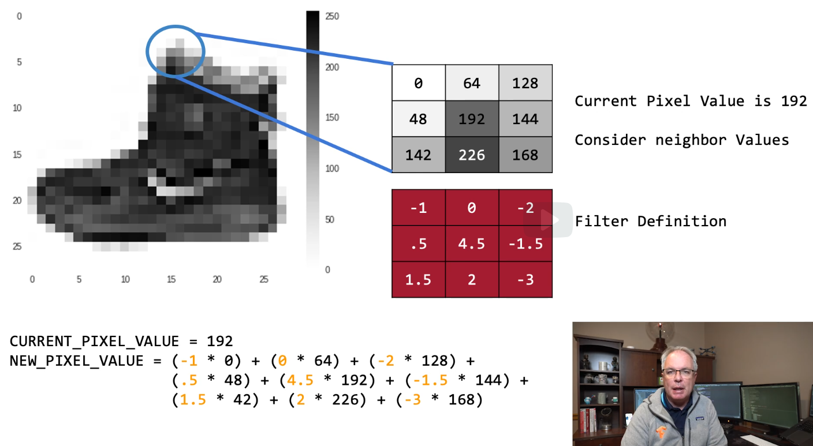
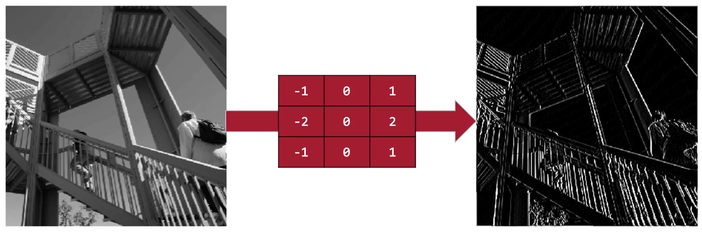
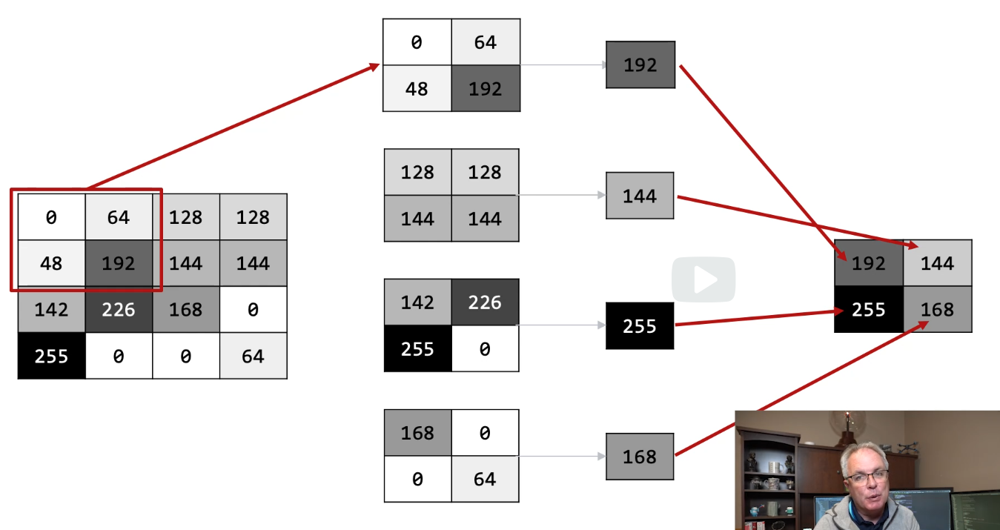
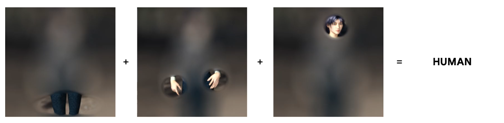

# convolutions

A convolution is a filter that passes over an image, processing it, and extracting features that show a commonolatity in the image.

* see lab8: lab8_ExploringConvolutions.ipynb

## filters

for example filter as horizontal line detector

By applying filters like these, you can remove almost everything
but a distinguishable feature.
And this process is called feature extraction.

## poling

Pooling is simply the process of removing pixels
while maintaining important information.

From each of these blocks, we pick the biggest value
and we throw the rest away.
We then reassemble these, and we have a new set of four pixels.

if we apply it to an image after filtering the image.
It can have the effect of enhancing the features that we extracted.

## compress

 if you're applying many filters to your image in a layer,
you're in effect making many copies of your image.
So if it's a large image, you end up with a lot
of data flowing through your network.
So it's good to have a way to compress that data without losing
the important features.

## multi layer

When you apply multiple layers of filters,
then really complex features, such as faces or hands
instead of the vertical or horizontal lines I've shown here,
could be spotted and extracted.

