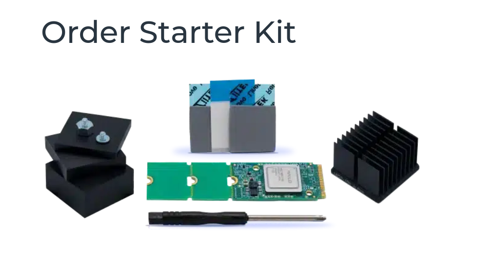
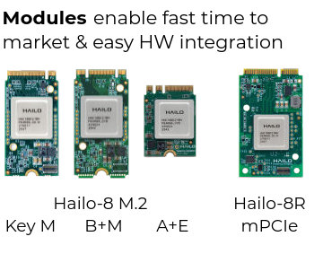
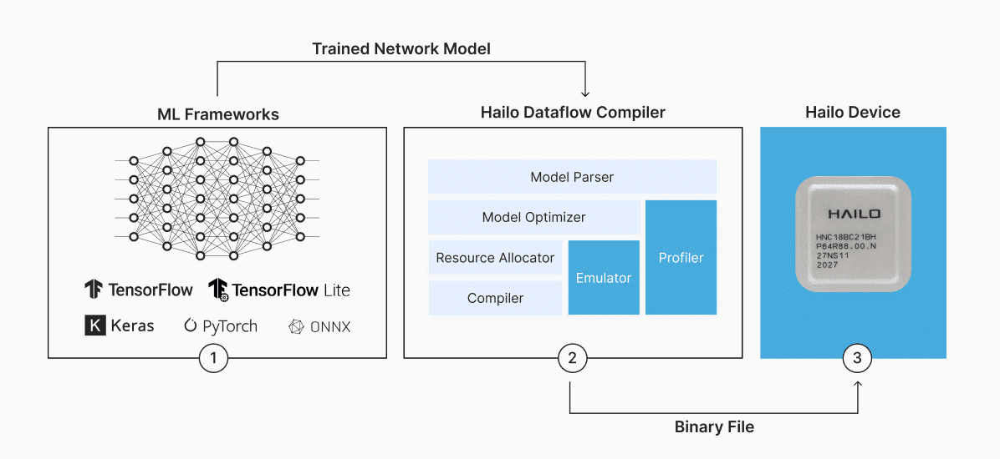
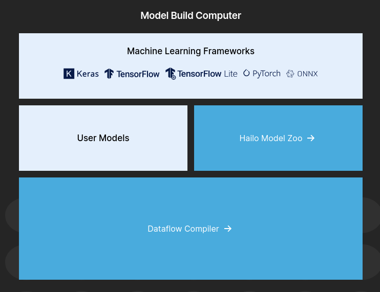
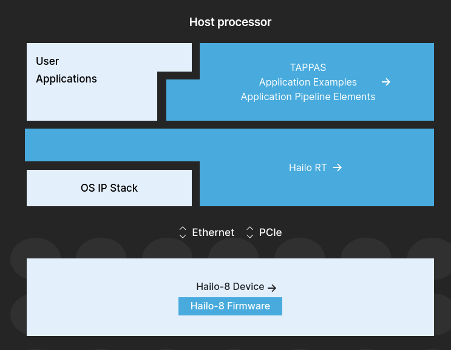

# start kit

## SW

## Model build environment:

Hailo Dataflow Compiler is used to compile a trained model to run on Hailo devices.

Hailo Model Zoo contains a large database of pre-trained models 

## Runtime environment:

HailoRT is used to load the compiled model to Hailo device and interact with it (using the PCIe driver).

TAPPAS includes complete examples and demos of using HailoRT to create full pipelines on top of Hailo devices.

