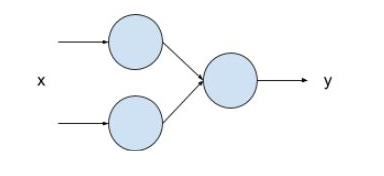

# multi-layer neural network

* see lab5_MultiNeuralNetwork.ipynb

```
my_layer_1 = keras.layers.Dense(units=2, input_shape=[1])
my_layer_2 = keras.layers.Dense(units=1)
model = tf.keras.Sequential([my_layer_1, my_layer_2])
model.compile(optimizer='sgd', loss='mean_squared_error')

xs = np.array([-1.0,  0.0, 1.0, 2.0, 3.0, 4.0], dtype=float)
ys = np.array([-3.0, -1.0, 1.0, 3.0, 5.0, 7.0], dtype=float)

model.fit(xs, ys, epochs=500)

```


