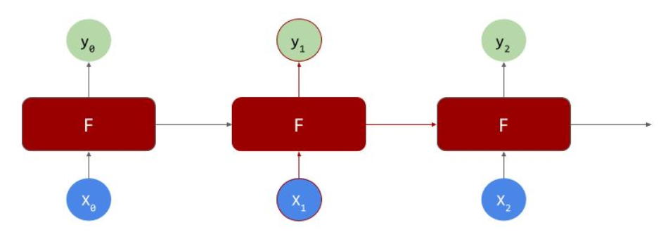

# Recurrent layers

are able to learn values in a sequence where each neuron learns values and passes those values to another neuron in the same layer. The basic idea can be represented like this:

Where, if we have a sequence of values, X0, X1, X2 that we want to learn a corresponding sequence Y0, Y1, Y2 for, then the idea is the the neurons (F) can not only try to match X0->Y0, but also pass values along the sequence, indicated by the right pointing arrows, so the input to the second neuron is the output from the first and X1, from which it can learn the parameters for Y1 and so on.
