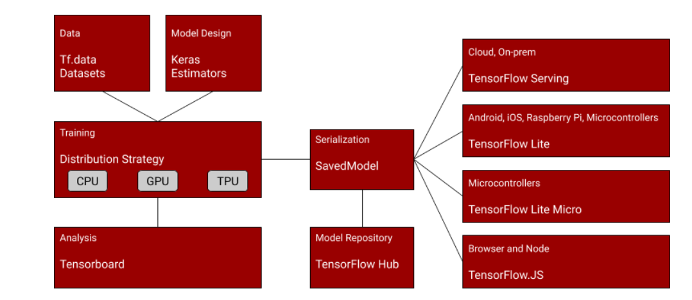

# basic model


The neural network would randomly initialize, effectively making a guess to the rules that match the data to the answers, and then over time it would loop through measuring the accuracy and continually optimizing.


```


import tensorflow as tf

data = tf.keras.datasets.mnist

 

(training_images, training_labels), (val_images, val_labels) = data.load_data()

training_images  = training_images / 255.0

val_images = val_images / 255.0

 

model = tf.keras.models.Sequential([tf.keras.layers.Flatten(input_shape=(28,28)),

                                    tf.keras.layers.Dense(20, activation=tf.nn.relu),

                                    tf.keras.layers.Dense(10, activation=tf.nn.softmax)])

 

model.compile(optimizer='adam',

              loss='sparse_categorical_crossentropy',

              metrics=['accuracy'])

model.fit(training_images, training_labels, epochs=20, 
          validation_data=(val_images, val_labels))

```


 instead of creating a program or an app, you train a model, and you use this model in future to get an inference based on the rules that it learned.


## save model

* https://www.tensorflow.org/guide/saved_model

