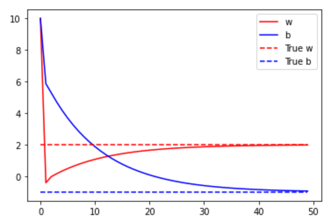

# lab2

* see: lab2_Mimimizing_Loss.ipynb

```
# First import the functions we will need
from __future__ import absolute_import, division, print_function, unicode_literals

try:
  # %tensorflow_version only exists in Colab.
  %tensorflow_version 2.x
except Exception:
  pass
import tensorflow as tf
import numpy as np
import matplotlib.pyplot as plt
```


```
# Define our initial guess
INITIAL_W = 10.0
INITIAL_B = 10.0

# Define our loss function
def loss(predicted_y, target_y):
  return tf.reduce_mean(tf.square(predicted_y - target_y))

# Define our training procedure
def train(model, inputs, outputs, learning_rate):
  with tf.GradientTape() as t:
    current_loss = loss(model(inputs), outputs)
    # Here is where you differentiate the model values with respect to the loss function
    dw, db = t.gradient(current_loss, [model.w, model.b])
    # And here is where you update the model values based on the learning rate chosen
    model.w.assign_sub(learning_rate * dw)
    model.b.assign_sub(learning_rate * db)
    return current_loss

# Define our simple linear regression model
class Model(object):
  def __init__(self):
    # Initialize the weights
    self.w = tf.Variable(INITIAL_W)
    self.b = tf.Variable(INITIAL_B)

  def __call__(self, x):
    return self.w * x + self.b
```


```

# Define our input data and learning rate
xs = [-1.0, 0.0, 1.0, 2.0, 3.0, 4.0]
ys = [-3.0, -1.0, 1.0, 3.0, 5.0, 7.0]
LEARNING_RATE=0.09

# Instantiate our model
model = Model()

# Collect the history of w-values and b-values to plot later
list_w, list_b = [], []
epochs = range(50)
losses = []
for epoch in epochs:
  list_w.append(model.w.numpy())
  list_b.append(model.b.numpy())
  current_loss = train(model, xs, ys, learning_rate=LEARNING_RATE)
  losses.append(current_loss)
  print('Epoch %2d: w=%1.2f b=%1.2f, loss=%2.5f' %
        (epoch, list_w[-1], list_b[-1], current_loss))

```

```

Mimimizing-Loss.ipynb_
GradientTape

The Calculus is managed by a TensorFlow Gradient Tape. You can learn more about the gradient tape at https://www.tensorflow.org/api_docs/python/tf/GradientTape, and we will discuss it later in the course.
Train our model

Epoch  0: w=10.00 b=10.00, loss=715.66669
Epoch  1: w=-0.41 b=5.86, loss=27.47032
Epoch  2: w=-0.02 b=5.28, loss=22.43888
Epoch  3: w=0.16 b=4.69, loss=18.46284
Epoch  4: w=0.33 b=4.16, loss=15.19137
Epoch  5: w=0.49 b=3.68, loss=12.49958
Epoch  6: w=0.63 b=3.25, loss=10.28476
Epoch  7: w=0.76 b=2.85, loss=8.46238
Epoch  8: w=0.87 b=2.50, loss=6.96291
Epoch  9: w=0.98 b=2.17, loss=5.72914
Epoch 10: w=1.07 b=1.88, loss=4.71398
Epoch 11: w=1.16 b=1.61, loss=3.87870
Epoch 12: w=1.24 b=1.37, loss=3.19143
Epoch 13: w=1.31 b=1.15, loss=2.62593
Epoch 14: w=1.37 b=0.95, loss=2.16064
Epoch 15: w=1.43 b=0.77, loss=1.77779
Epoch 16: w=1.48 b=0.60, loss=1.46278
Epoch 17: w=1.53 b=0.45, loss=1.20359
Epoch 18: w=1.57 b=0.32, loss=0.99032
Epoch 19: w=1.61 b=0.20, loss=0.81484
Epoch 20: w=1.65 b=0.08, loss=0.67046
Epoch 21: w=1.68 b=-0.02, loss=0.55166
Epoch 22: w=1.71 b=-0.11, loss=0.45391
Epoch 23: w=1.74 b=-0.19, loss=0.37348
Epoch 24: w=1.76 b=-0.27, loss=0.30730
Epoch 25: w=1.79 b=-0.33, loss=0.25285
Epoch 26: w=1.81 b=-0.40, loss=0.20805
Epoch 27: w=1.82 b=-0.45, loss=0.17118
Epoch 28: w=1.84 b=-0.50, loss=0.14085
Epoch 29: w=1.85 b=-0.55, loss=0.11589
Epoch 30: w=1.87 b=-0.59, loss=0.09536
Epoch 31: w=1.88 b=-0.63, loss=0.07846
Epoch 32: w=1.89 b=-0.66, loss=0.06456
Epoch 33: w=1.90 b=-0.69, loss=0.05312
Epoch 34: w=1.91 b=-0.72, loss=0.04371
Epoch 35: w=1.92 b=-0.75, loss=0.03596
Epoch 36: w=1.93 b=-0.77, loss=0.02959
Epoch 37: w=1.93 b=-0.79, loss=0.02435
Epoch 38: w=1.94 b=-0.81, loss=0.02003
Epoch 39: w=1.95 b=-0.83, loss=0.01648
Epoch 40: w=1.95 b=-0.85, loss=0.01356
Epoch 41: w=1.95 b=-0.86, loss=0.01116
Epoch 42: w=1.96 b=-0.87, loss=0.00918
Epoch 43: w=1.96 b=-0.88, loss=0.00756
Epoch 44: w=1.97 b=-0.90, loss=0.00622
Epoch 45: w=1.97 b=-0.91, loss=0.00511
Epoch 46: w=1.97 b=-0.91, loss=0.00421
Epoch 47: w=1.97 b=-0.92, loss=0.00346
Epoch 48: w=1.98 b=-0.93, loss=0.00285
Epoch 49: w=1.98 b=-0.94, loss=0.00234

Plot our trained values over time


```


```
# Plot the w-values and b-values for each training Epoch against the true values
TRUE_w = 2.0
TRUE_b = -1.0
plt.plot(epochs, list_w, 'r', epochs, list_b, 'b')
plt.plot([TRUE_w] * len(epochs), 'r--', [TRUE_b] * len(epochs), 'b--')
plt.legend(['w', 'b', 'True w', 'True b'])
plt.show()


```



