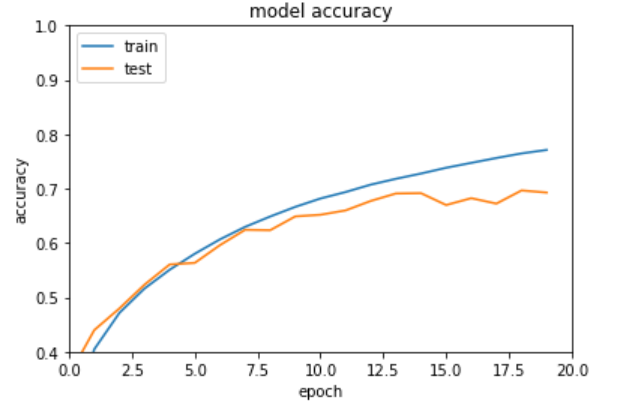
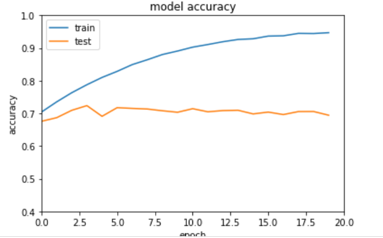

# play2


* dataset: CIFAR-10 ; design your own model and then select your optimizer and loss function.
* the dataset: https://www.cs.toronto.edu/~kriz/cifar.html
* CIFAR are 32x32 color images (3 color channels)
* CIFAR ones can have the object with a background -- for example airplanes might have a cloudy sky behind them!


## layers

* your model may want to learn some high level features and then classify them.

```
FIRST_LAYER = layers.Conv2D(32, (3, 3), activation='relu', input_shape=(32, 32, 3))

HIDDEN_LAYER_TYPE_1 = layers.MaxPooling2D((2, 2))

HIDDEN_LAYER_TYPE_2 = layers.Conv2D(64, (3, 3), activation='relu')

HIDDEN_LAYER_TYPE_3 = layers.MaxPooling2D((2, 2))

HIDDEN_LAYER_TYPE_4 = layers.Conv2D(64, (3, 3), activation='relu')

HIDDEN_LAYER_TYPE_5 = layers.Dense(64, activation='relu')

LAST_LAYER = layers.Dense(10)


```

## loss function

* for the loss we want something that can help optimize for differences across categories

```
LOSS = tf.keras.losses.SparseCategoricalCrossentropy(from_logits=True)

# Compile the model
model.compile(optimizer='sgd',
              loss=LOSS,
              metrics=['accuracy'])

```

## optimizer

for:

```
model.compile(optimizer='sgd',
==============================

1563/1563 [==============================] - 11s 7ms/step - loss: 0.6585 - accuracy: 0.7712 - val_loss: 0.9173 - val_accuracy: 0.6928

```



* pick a better optimizer : optimizer with an adaptive learning rate often performs quite well

```
OPTIMIZER = 'adam'
======================
1563/1563 [==============================] - 12s 8ms/step - loss: 0.1525 - accuracy: 0.9470 - val_loss: 1.7749 - val_accuracy: 0.6943


```



