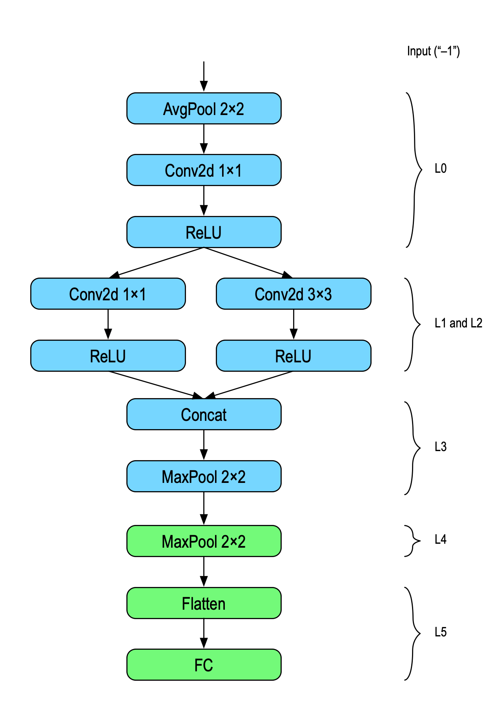
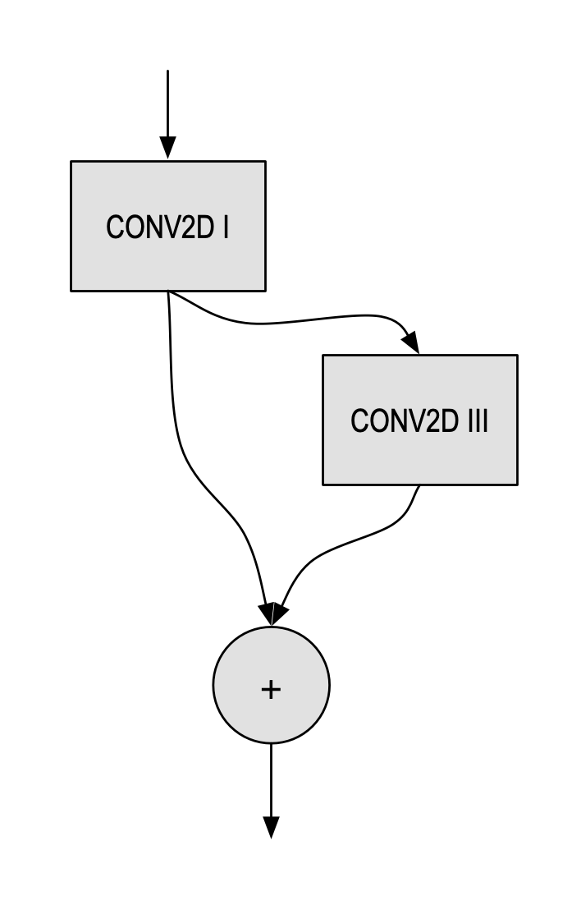
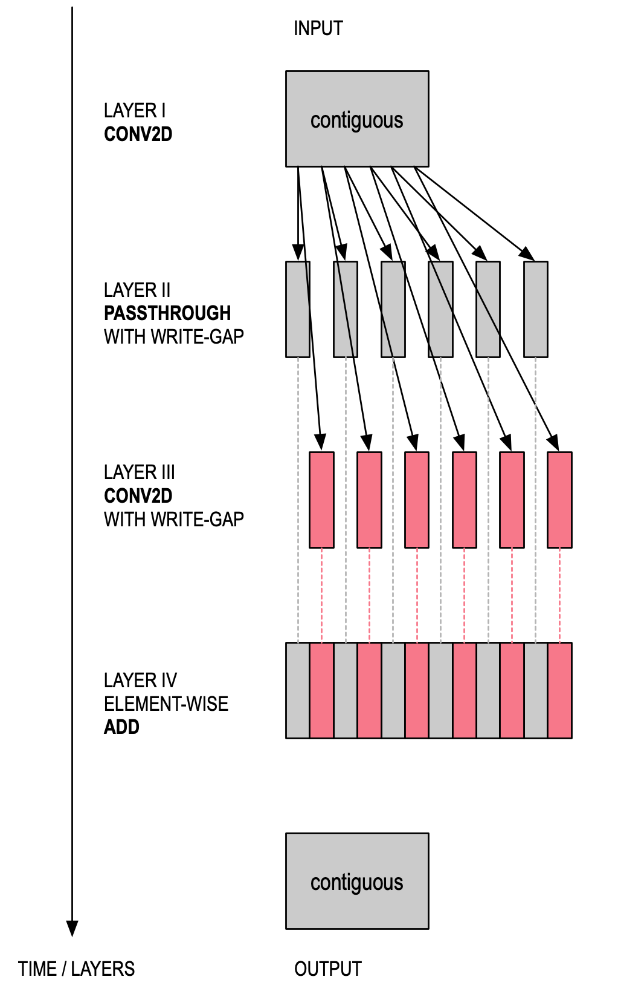

### Network Loader Configuration Language

Network descriptions are written in YAML (see <https://en.wikipedia.org/wiki/YAML>). There are two sections in each file — global statements and a sequence of layer descriptions.

*Note: The network loader automatically checks the configuration file for syntax errors and prints warnings for non-fatal errors if `yamllint` is installed in the shell search path. To perform the same checks manually, run:* `yamllint configfile.yaml` (to use a different linter, specify `--yamllint mylinter`).

#### Purpose of the YAML Network Description

The network description must match the model that was used for training. In effect, the checkpoint file contains the trained weights, and the YAML file contains a description of the network structure. Additionally, the YAML file (sometimes also called “sidecar file”) describes which processors to use (`processors`) and which offsets to read and write data from (`in_offset` and `out_offset`).

##### Data Memory Ping-Pong

For simple networks with relatively small data dimensions, the easiest way to use the data offsets is by “ping-ponging” between offset 0 and half the memory (offset 0x4000 on MAX78000 or offset 0xA000 on MAX78002). For example, the input is loaded at offset 0, and the first layer produces its output at offset 0x4000. The second layer reads from 0x4000 and writes to 0. Assuming the dimensions are small enough, this easy method avoids overwriting an input that has not yet been consumed by the accelerator.

#### Global Configuration

##### `arch` (Mandatory)

`arch` specifies the network architecture, for example `ai84net5`. This key is matched against the architecture embedded in the checkpoint file.

##### `bias` (Optional, Test Only)

The `bias` configuration is only used for test data. *To use bias with trained networks, use the `bias` parameter in PyTorch’s `nn.Module.Conv2d()` function. The converter tool will then automatically add bias parameters as needed.*

##### `dataset` (Mandatory)

`dataset` configures the data set for the network. Data sets are for example `mnist`, `fashionmnist`, and `cifar-10`. This key is descriptive only, it does not configure input or output dimensions or channel count.

##### `output_map` (Optional)

The global `output_map`, if specified, overrides the memory instances where the last layer outputs its results. If not specified, this will be either the `output_processors` specified for the last layer, or, if that key does not exist, default to the number of processors needed for the output channels, starting at 0. Please also see `output_processors`.

Example:
        `output_map: 0x0000000000000ff0`

##### `unload` (Optional)

By default, the function `cnn_unload()` is automatically generated from the network’s output layers (typically, the final layer). `unload` can be used to override the shape and sequence of data copied from the CNN. It is possible to specify multiple `unload` list items, and they will be processed in the order they are given.

The following keywords are required for each `unload` list item:

`processors`: The processors data is copied from
`channels`: Data channel count
`dim`: Data dimensions (1D or 2D)
`offset`: Data source offset
`width`: Data width (optional, defaults to 8) — either 8 or 32
`write_gap`: Gap between data words (optional, defaults to 0)

##### `layers` (Mandatory)

`layers` is a list that defines the per-layer description, as shown below:

#### Per-Layer Configuration

Each layer in the `layers` list describes the layer’s processors, convolution type, activation, pooling, weight and output sizes, data input format, data memory offsets, and its processing sequence. Several examples are located in the `networks/` and `tests/` folders.

##### `name` (Optional)

`name` assigns a name to the current layer. By default, layers are referenced by their sequence number. Using `name`, they can be referenced using a string. *Note: “stop” and “input” are reserved names.*

Example:
        `name: parallel_1_2`

##### `sequence` (Optional)

This key allows overriding of the processing sequence. The default is `0` for the first layer, or the previous layer’s sequence + 1 for other layers.

`sequence` numbers may have gaps. The software will sort layers by their numeric value, with the lowest value first.

##### `next_sequence` (Optional)

On MAX78000, layers are executed sequentially. On MAX78002, this key can optionally be used to specify the next layer (by either using an integer number or a name). `stop` terminates execution.

Example:
        `next_sequence: final`

##### `processors` (Mandatory)

`processors` specifies which processors will handle the input data. The processor map must match the number of input channels, and the input data format. For example, in CHW format, processors must be attached to different data memory instances.

`processors` is specified as a 64-bit hexadecimal value. Dots (‘.’) and a leading ‘0x’ are ignored.

*Note: When using multi-pass (i.e., using more than 64 channels), the number of processors is an integer division of the channel count, rounded up to the next multiple of 4. For example, 52 processors are required for 100 channels (since 100 div 2 = 50, and 52 is the next multiple of 4). For best efficiency, use channel counts that are multiples of 4.*

Example for three processors 0, 4, and 8:
        `processors: 0x0000.0000.0000.0111`

Example for four processors 0, 1, 2, and 3:
        `processors: 0x0000.0000.0000.000f`

##### `output_processors` (Optional)

`output_processors` specifies which data memory instances and 32-bit word offsets to use for the layer’s output data. When not specified, this key defaults to the next layer’s `processors`, or, for the last layer, to the global `output_map`. `output_processors` is specified as a 64-bit hexadecimal value. Dots (‘.’) and a leading ‘0x’ are ignored.

##### `out_offset` (Optional)

`out_offset` specifies the relative offset inside the data memory instance where the output data should be written to. When not specified, `out_offset` defaults to `0`. See also [Data Memory Ping-Pong](#data-memory-ping-pong).

Example:
        `out_offset: 0x2000`

##### `in_offset` (Optional)

`in_offset` specifies the offset into the data memory instances where the input data should be loaded from. When not specified, this key defaults to the previous layer’s `out_offset`, or `0` for the first layer.

Example:
        `in_offset: 0x2000`

##### `output_width` (Optional)

When **not** using an `activation` and when `operation` is **not** `None`/`Passthrough`, a layer can output `32` bits of unclipped data in Q17.14 format. Typically, this is used for the **last** layer. The default is `8` bits. *Note that the corresponding model’s layer must be trained with* `wide=True` *when* `output_width` *is 32*.

Example:
        `output_width: 32`

##### `data_format` (Optional)

When specified for the first layer only, `data_format` can be either `chw`/`big` or `hwc`/`little`. The default is `hwc`. Note that the data format interacts with `processors`, see [Channel Data Formats](#channel-data-formats).

##### `operation`

This key (which can also be specified using `op`, `operator`, or `convolution`) selects a layer’s main operation after the optional input pooling.
When this key is not specified, a warning is displayed, and `Conv2d` is selected.

| Operation                 | Description                                                  |
| :------------------------ | :----------------------------------------------------------- |
| `Conv1d`                  | 1D convolution over an input composed of several input planes |
| `Conv2d`                  | 2D convolution over an input composed of several input planes |
| `ConvTranspose2d`         | 2D transposed convolution (upsampling) over an input composed of several input planes |
| `None` or `Passthrough`   | No operation *(note: input and output processors must be the same)* |
| `Linear` or `FC` or `MLP` | Linear transformation to the incoming data (fully connected layer) |
| `Add`                     | Element-wise addition                                        |
| `Sub`                     | Element-wise subtraction                                     |
| `BitwiseXor` or `Xor`     | Element-wise binary XOR                                      |
| `BitwiseOr` or `Or`       | Element-wise binary OR                                       |

Element-wise operations default to two operands. This can be changed using the `operands` key.

##### `eltwise` (Optional)

Element-wise operations can also be added “in-flight” to `Conv2d`. In this case, the element-wise operation is specified using the `eltwise` key.
*Note: On MAX78000, this is only supported for 64 channels, or up to 128 channels when only two operands are used. Use a separate layer for the element-wise operation when more operands or channels are needed instead of combining the element-wise operator with a convolution.*

Example:
        `eltwise: add`

##### `dilation` (Optional)

Specifies the dilation for Conv1d/Conv2d operations (default: `1`). *Note: Conv2d dilation is only supported on MAX78002.*

Example:
        `dilation: 7`

##### `groups` (Optional)

By default, Conv1d and Conv2d are configured with *groups=1,* a “full” convolution. On MAX78002 only, depthwise separable convolutions can be specified using groups=channels (input channels must match the output channels).

Example:
        `op: conv2d`
        `groups: 64`

##### `pool_first` (Optional)

When using both pooling and element-wise operations, pooling is performed first by default. Optionally, the element-wise operation can be performed before the pooling operation by setting `pool_first` to `False`.

Example:
        `pool_first: false`

##### `operands` (Optional)

For any element-wise `operation`, this key configures the number of operands from `2` to `16` inclusive. The default is `2`.

Example:
        `operation: add`
        `operands: 4`

##### `activate` (Optional)

This key describes whether to activate the layer output (the default is to not activate). When specified, this key must be `ReLU`, `Abs` or `None` (the default). *Please note that there is always an implicit non-linearity when outputting 8-bit data since outputs are clamped to $[–1, +127/128]$, see [activation functions](#activation-functions).*

`output_shift` can be used for (limited) “linear” activation.

##### `quantization` (Optional)

This key describes the width of the weight memory in bits and can be `1`, `2`, `4`, `8`, or `binary` (MAX78002 only). Specifying a `quantization` that is smaller than what the weights require results in an error message. The default value is based on the `weight_bits` field in `state_dict` read from the quantized checkpoint for the layer.

*On MAX78002 only, `binary` sets the alternate 1-bit representation of –1/+1.*

Example:
        `quantization: 4`

##### `output_shift` (Optional)

When `output_width` is 8, the 32-bit intermediate result can be shifted left or right before reduction to 8-bit. The value specified here is cumulative with the value generated from and used by `quantization`. Note that `output_shift` is not supported for passthrough layers.

The 32-bit intermediate result is multiplied by $2^{totalshift}$, where the total shift count must be within the range $[-15, +15]$, resulting in a factor of $[2^{–15}, 2^{15}]$ or $[0.0000305176$ to $32768]$.

| weight quantization | shift used by quantization | available range for `output_shift` |
| ------------------- | -------------------------- | ---------------------------------- |
| 8-bit               | 0                          | $[-15, +15]$                       |
| 4-bit               | 4                          | $[-19, +11]$                       |
| 2-bit               | 6                          | $[-21, +9]$                        |
| 1-bit               | 7                          | $[-22, +8]$                        |

Using `output_shift` can help normalize data, particularly when using small weights. By default, `output_shift` is generated by the training software, and it is used for batch normalization as well as quantization-aware training.

*Note:* When using 32-bit wide outputs in the final layer, no hardware shift is performed and `output_shift` is ignored.

Example:
        `output_shift: 2`

##### `kernel_size` (Optional)

* For `Conv2d`, this key must be `3x3` (the default) or `1x1`.
* For `Conv1d`, this key must be `1` through `9`.
* For `ConvTranspose2d`, this key must be `3x3` (the default).

Example:
        `kernel_size: 1x1`

##### `stride` (Optional)

This key must be `1` or `[1, 1]`.

##### `pad` (Optional)

`pad` sets the padding for the convolution.

* For `Conv2d`, this value can be `0`, `1` (the default), or `2`.
* For `Conv1d`, the value can be `0`, `1`, `2`, or `3` (the default).
* For `ConvTranspose2d`, this value can be `0`, `1` (the default), or `2`. *Note that the value follows PyTorch conventions and effectively adds* `(kernel_size – 1) – pad` *amount of zero padding to both sizes of the input, so “0” adds 2 zeros each and “2” adds no padding.*
* For `Passthrough`, this value must be `0` (the default).

##### `max_pool` (Optional)

When specified, performs a `MaxPool` before the convolution. The pooling size can be specified as an integer (when the value is identical for both dimensions, or for 1D convolutions), or as two values in order `[H, W]`.

Example:
        `max_pool: 2`

##### `avg_pool` (Optional)

When specified, performs an `AvgPool` before the convolution. The pooling size can be specified as an integer (when the value is identical for both dimensions, or for 1D convolutions), or as two values in order `[H, W]`.

Example:
        `avg_pool: 2`

##### `pool_dilation` (Optional)

When performing a pooling operation *on MAX78002*, this key describes the pool dilation. The pooling dilation can be specified as an integer (when the value is identical for both dimensions, or for 1D convolutions), or as two values in order `[H, W]`. The default is `1` or `[1, 1]`.

Example:
        `pool_dilation: [2, 1]`

##### `pool_stride` (Optional)

When performing a pooling operation, this key describes the pool stride. The pooling stride can be specified as an integer (when the value is identical for both dimensions, or for 1D convolutions), or as two values in order `[H, W]`, where both values must be identical. The default is `1` or `[1, 1]`.

Example:
        `pool_stride: [2, 2]`

##### `in_channels` (Optional)

`in_channels` specifies the number of channels of the input data. This is usually automatically computed based on the weights file and the layer sequence. This key allows overriding of the number of channels. See also: `in_dim`.

Example:
        `in_channels: 8`

##### `in_dim` (Optional)

`in_dim` specifies the dimensions of the input data. This is usually automatically computed based on the output of the previous layer or the layer(s) referenced by `in_sequences`. This key allows overriding of the automatically calculated dimensions. `in_dim` must be used when changing from 1D to 2D data or vice versa. 1D dimensions can be specified as a tuple `[L, 1]` or as an integer `L`.

See also: `in_channels`, `in_crop`.

Examples:
        `in_dim: [64, 64]`
        `in_dim: 32`

##### `in_crop` (Optional)

`in_crop` specifies a number of rows (2D) or data bytes (1D) to skip (crop) when using the previous layer's output as input. By also adjusting `in_offset`, this provides the means to crop the top/bottom of an image or the beginning/end of 1D data. The dimensions and offsets are validated to match (minus the crop amount).

See also: `in_dim`, `in_offset`.

Example (1D cropping):
        `# Output data had L=512`
        `in_offset: 0x000c  # Skip 3 (x4 processors) at beginning`
        `in_dim: 506  # Target length = 506`
        `in_crop: [3, 3]  # Crop 3 at the beginning, 3 at the end`

##### `in_sequences` (Optional)

By default, a layer’s input is the output of the previous layer. `in_sequences` can be used to point to the output of one or more arbitrary previous layers, for example when processing the same data using two different kernel sizes, or when combining the outputs of several prior layers. `in_sequences` can be specified as a single item (for a single input) or as a list (for multiple inputs). Both layer sequence numbers as well as layer names can be used. As a special case, `-1` or `input` refer to the input data. The `in_offset` and `out_offset` must be set to match the specified sequence.

###### Multiple Arguments (Element-wise Operations)

`in_sequences` is used to specify the inputs for a multi-operand element-wise operator (for example, `add`). The output processors for all arguments of the sequence must match.

###### Layer Concatenation

`in_sequences` can also be used to specify concatenation similar to `torch.cat()`.

The output processors must be adjacent for all sequence arguments, and arguments listed earlier must use lower processor numbers than arguments listed later. The order of arguments of `in_sequences` must match the model. The following code shows an example `forward` function for a model that concatenates two values:

```python
def forward(self, x):
    x = self.conv0(x)  # Layer 0
    y = self.conv1(x)  # Layer 1
    y = torch.cat((y, x), dim=1)
```

In this case, `in_sequences` would be `[1, 0]` since `y` (the output of layer 1) precedes `x` (the output of layer 0) in the `torch.cat()` statement.

Examples:
        `in_sequences: [2, 3]`
        `in_sequences: [expand_1x1, expand_3x3]`

See the [Fire example](#example) for a network that uses `in_sequences`.

##### `out_channels` (Optional)

`out_channels` specifies the number of channels of the output data. This is usually automatically computed based on the weights and layer sequence. This key allows overriding the number of output channels.

Example:
        `out_channels: 8`

##### `streaming` (Optional)

`streaming` specifies that the layer is using [streaming mode](#streaming-mode). This is necessary when the input data dimensions exceed the available data memory. When enabling `streaming`, all prior layers have to enable `streaming` as well. `streaming` can be enabled for up to 8 layers.

Example:
        `streaming: true`

##### `flatten` (Optional)

`flatten` specifies that 2D input data should be transformed to 1D data for use by a `Linear` layer. *Note that flattening cannot be used in the same layer as pooling.*

Example:
        `flatten: true`

##### `write_gap` (Optional)

`write_gap` specifies the number of channels that should be skipped during write operations (this value is multiplied with the output multi-pass, i.e., write every *n*th word where *n = write_gap × output_multipass*). This creates an interleaved output that can be used as the input for subsequent layers that use an element-wise operation, or to concatenate multiple inputs to form data with more than 64 channels. The default is 0.

Set `write_gap` to `1` to produce output for a subsequent two-input element-wise operation.

Example:
        `write_gap: 1`

##### `read_gap` (Optional)

On MAX78002 only, when multi-pass is not used (i.e., typically 64 input channels or less), data can be fetched while skipping bytes. This allows a layer to directly consume data produced by a layer with `write_gap` without the need for intermediate layers. The default is 0.

Example:
        `read_gap: 1`

##### `bias_group` (Optional)

For layers that use a bias, this key can specify one or more bias memories that should be used. By default, the software uses a “Fit First Descending (FFD)” allocation algorithm that considers the largest bias lengths first, and then the layer number, and places each bias in the available quadrant with the most available space, descending to the smallest bias length.

“Available quadrants” is the complete list of quadrants used by the network (in any layer). `bias_group` must reference one or more of these available quadrants.

`bias_group` can be a list of integers or a single integer.

Example:
        `bias_group: 0`

##### `output` (Optional)

By default, the final layer is used as the output layer. Output layers are checked using the known-answer test, and they are copied from hardware memory when `cnn_unload()` is called. The tool also checks that output layer data isn’t overwritten by any later layers.

When specifying `output: true`, any layer (or a combination of layers) can be used as an output layer.
*Note:* When `unload:` is used, output layers are not used for generating `cnn_unload()`.

Example:
        `output: true`

##### `weight_source` (Optional)

Certain networks share weights between layers. The tools automatically deduplicate weights and bias values (unless `--no-deduplicate-weights` is specified). When the checkpoint file does *not* contain duplicated weights, `weight_source: layer` is needed in the YAML configuration for the layer(s) that reuse(s) weights. `layer` can be specified as layer number or name.

Example:
        `weight_source: conv1p3`

#### Rolling Buffers

Certain networks (such as TCN) require rolling data buffers. These are implemented in the YAML file (for a complete example, please see `networks/ai85-kinetics-actiontcn.yaml`).

##### `data_buffer` (Global)

The data buffer is allocated and named using the global `data_buffer` configuration key. `processor`,  `dim` (1D or 2D), `channels`, and `offset` must be defined.

Example:

```yaml
data_buffer:
  - processors: 0xffffffff00000000
    dim: 15
    channels: 32
    offset: 0x7fc4
    name: tcn_buffer
```

##### `buffer_shift` (per layer)

The buffer is shifted `n` places using `buffer_shift: n`. `in_offset` and `in_dim` are required.

Example:

```yaml
- processors: 0xffffffff00000000
    output_processors: 0xffffffff00000000
    in_offset: 0x7FC8
    in_channels: 32
    in_dim: 14
    in_sequences: tcn_buffer
    out_offset: 0x7fc4
    operation: passthrough
    buffer_shift: 1
    name: buffer_shift
```

##### `buffer_insert` (per layer)

New data is added using `buffer_insert: n`.

Example:

```yaml
 - processors: 0xffffffffffffffff
    output_processors: 0xffffffff00000000
    in_offset: 0x5000
    out_offset: 0x7FFC
    operation: Conv2d
    in_sequences: res4_out
    buffer_insert: 1
    kernel_size: 3x3
    pad: 0
    activate: ReLU
    name: conv5
```

##### Buffer use

The buffer is used with `in_sequences`, in the example `in_sequences: tcn_buffer`. To use the buffer contents as input, `in_offset` and `in_dim` are required.

#### Dropout and Batch Normalization

* Dropout is only used during training, and corresponding YAML entries are not needed.
* Batch normalization (“batchnorm”) is fused into the preceding layer’s weights and bias values (see [Batch Normalization](#batch-normalization)), and YAML entries are not needed.

#### Example

The following shows an example for a single “Fire” operation, the MAX78000/MAX78002 hardware layer numbers and its YAML description.



```yaml
---
arch: ai85firetestnet
dataset: CIFAR-10
# Input dimensions are 3x32x32

layers:
  ### Fire
  # Squeeze (0)
  - avg_pool: 2
    pool_stride: 2
    pad: 0
    in_offset: 0x1000
    processors: 0x0000000000000007
    data_format: HWC
    out_offset: 0x0000
    operation: conv2d
    kernel_size: 1x1
    activate: ReLU
  # Expand 1x1 (1)
  - in_offset: 0x0000
    out_offset: 0x1000
    processors: 0x0000000000000030
    output_processors: 0x0000000000000f00
    operation: conv2d
    kernel_size: 1x1
    pad: 0
    activate: ReLU
    name: expand_1x1
  # Expand 3x3 (2)
  - in_offset: 0x0000
    out_offset: 0x1000
    processors: 0x0000000000000030
    output_processors: 0x000000000000f000
    operation: conv2d
    kernel_size: 3x3
    activate: ReLU
    in_sequences: 0
    name: expand_3x3
  # Concatenate (3)
  - max_pool: 2
    pool_stride: 2
    in_offset: 0x1000
    out_offset: 0x0000
    processors: 0x000000000000ff00
    operation: none
    in_sequences: [expand_1x1, expand_3x3]
  ### Additional layers (4, 5)
  - max_pool: 2
    pool_stride: 2
    out_offset: 0x1000
    processors: 0x000000000000ff00
    operation: none
  - flatten: true
    out_offset: 0x0000
    op: mlp  # The fully connected (FC) layer L5
    processors: 0x000000000000ff00
    output_width: 32
```

#### Residual Connections

Many networks use residual connections. In the following example, the convolution on the right works on the output data of the first convolution. However, that same output data also “bypasses” the second convolution and is added to the output.



On MAX78000/MAX78002, the element-wise addition works on “interleaved data,” i.e., each machine fetch gathers one operand.

In order to achieve this, a layer must be inserted that does nothing else but reformat the data into interleaved format using the `write_gap` keyword (this operation happens in parallel and is fast).

```yaml
---
...
layers:
  ...
  # Layer I
  - out_offset: 0x0000
    processors: 0x0ffff00000000000
    operation: conv2d
    kernel_size: 3x3
    pad: 1
    activate: ReLU
  
  # Layer II - re-format data with gap
  - out_offset: 0x2000
    processors: 0x00000000000fffff
    output_processors: 0x00000000000fffff
    operation: passthrough
    write_gap: 1
    name: layerII
  
  # Layer III
  - in_offset: 0x0000
    out_offset: 0x2004
    processors: 0x00000000000fffff
    operation: conv2d
    kernel_size: 3x3
    pad: 1
    activate: ReLU
    write_gap: 1
    name: layerIII
  
  # Layer IV - Residual
  - in_sequences: [layerII, layerIII]
    in_offset: 0x2000
    out_offset: 0x0000
    processors: 0x00000000000fffff
    eltwise: add
    ...
```

The same network can also be viewed graphically:


